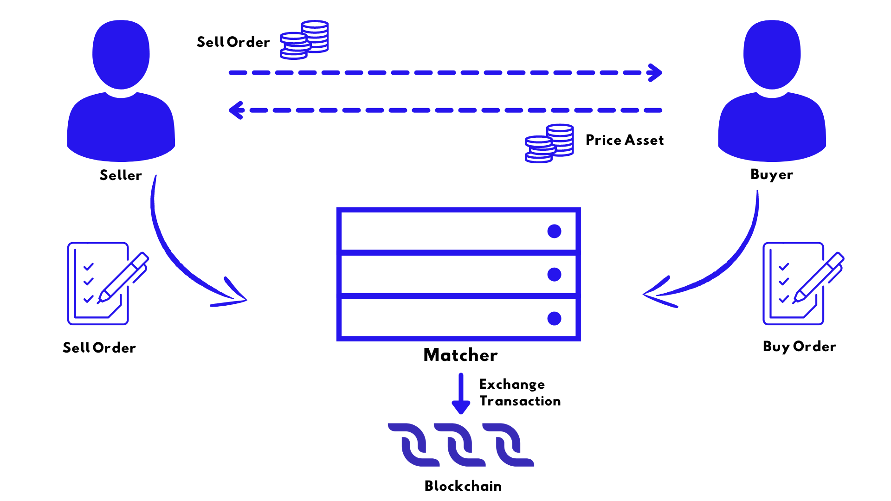

***********
Transaction
***********

Transaction Issue
=================

How to Sign and Send Transactions
---------------------------------

* In `Decentral.Exchange <https://decentral.exchange/>`_ you can create some types of transactions such as transfer, issue/reissue/burn, sponsor fee transaction, set asset script, create alias.
* Via :ref:`Node REST API <documentation:placeholder>`:

  * The POST /transactions/broadcast method sends a signed transaction to a node;
  * The POST /transactions/sign method generates transaction signature (but this method is only available to the node owner).

Transaction Sender and Signature
--------------------------------

Each transaction contains the public key of the sender’s account, on behalf of which the action is performed on the blockchain. :ref:`Smart accounts and dApps <02_decentralchain/01_account:dApp and Smart Account>` can set their own rules for outgoing transactions verification. 

Transactions that are sent from an ordinary account (without script) must contain the sender's digital signature. The sender generates a signature using the account's private key. Along with the signature, the transaction contains the sender's public key, so the node (and anyone) can verify the integrity of the transaction data and the authenticity of the signature, that is, make sure that the signature of the transaction matches the public key.

After Transaction is Sent
-------------------------

Upon receiving a transaction, the node validates its signature, checks the sender's balance, and so on, see the :ref:`transaction validation <02_decentralchain/03_transaction:Transaction Validation>` article for details. If the transaction is valid, the node puts the transaction to the UTX pool, which is a list of transactions awaiting to be added, and also broadcasts the transaction to other nodes of the blockchain network.

Due to block size limitation (:math:`1` MB) the transaction may not get to the block immediately. First of all, nodes add the most “profitable” transactions with the highest fee per byte.
After being added to a block, the transaction changes the blockchain state: account balances, records in the account data storage, and so on.
The transaction may never be added to a block if it becomes invalid while waiting in the UTX pool. For example, the transaction has expired (the timestamp is more than :math:`2` hours behind current time) or another transaction has changed the blockchain state and now the sender's balance is insufficient to execute the transaction or the account or asset script denies the transaction.

Transaction Proofs
==================

Verification by Script
----------------------

If the transaction sender is a :ref:`dApp or smart account <02_decentralchain/01_account:dApp and Smart Account>`, then the transaction is verified by the script assigned to the account instead of signature verification. The script allows or denies the transaction depending on whether it meets the specified conditions. In particular, the script can run various verifications of the proofs.

A common example is a smart account with a multisignature where three co-owner users store shared funds. 

Transaction Fees
================

Transaction fee is a fee that an :ref:`account <02_decentralchain/01_account:Account>` owner pays to send a :ref:`transaction <02_decentralchain/03_transaction:Transaction>`. A transaction sender can specify any amount of fee but not less than the minimum amount. The larger the fee is, the quicker the transaction will be added to the new :ref:`block <02_decentralchain/04_block:Block>`.
For :ref:`invoke script transactions <02_decentralchain/03_transaction:Invoke Script Transaction>` and :ref:`transfer transaction <02_decentralchain/03_transaction:Transfer Transaction>`, a sender can specify a transaction fee nominated in a sponsored asset instead of :ref:`DecentralCoins <02_decentralchain/02_token(asset):DecentralCoin>`, see the section :ref:`fee in sponsored asset <02_decentralchain/03_transaction:Fee in Sponsored Asset>` below.

Regular Fees
------------

Minimum Fee
^^^^^^^^^^^

The minimum fees in DecentralCoins for each type of transaction are listed below.

* If the transaction sender is a :ref:`dApp or smart account <02_decentralchain/01_account:dApp and Smart Account>`, and the complexity of the account script or dApp script verifier function exceeds the :ref:`sender complexity threshold <03_ride-language/07_dapp-to-app-invocation:Limitations>`, the minimum fee is increased by :math:`0.004` DecentralCoins. If the order sender in :ref:`exchange transaction <02_decentralchain/03_transaction:Exchange Transaction>` is a dApp or smart account, this does nor affect the minimum fee.
* The minimum fee is increased by :math:`0.004` DecentralCoins for each smart asset involved, except for:

  * :ref:`Invoke script transactions <02_decentralchain/03_transaction:Invoke Script Transaction>`,
  * :ref:`Smart assets <02_decentralchain/02_token(asset):Smart Asset>` used as matcher fees in exchange transactions.

:strong:`Example 1`

* The minimum fee for a transfer transaction:
* No smart account or smart assets: :math:`0.001` DecentralCoins.
* Transfer from smart account*: :math:`0.001 + 0.004 = 0.005` DecentralCoins.
* Transfer of smart asset: :math:`0.001 + 0.004 = 0.005` DecentralCoins.
* Transfer of smart asset sent from smart account*: :math:`0.001 + 0.004 + 0.004 = 0.009` DecentralCoins.

If the account script complexity is higher than the :ref:`sender complexity threshold <03_ride-language/07_dapp-to-app-invocation:Limitations>`.

:strong:`Example 2`

The minimum fee for an Invoke Script transaction:

* No smart account, no assets issued: :math:`0.005` DecentralCoins.
* dApp script invocation is sent from a smart account*: :math:`0.005 + 0.004 = 0.009` DecentralCoins.
* dApp script invocation issues an asset that is not :ref:`non-fungible tokens <02_decentralchain/02_token(asset):Non-Fungible Token>`: :math:`0.005 + 1 = 1.005` DecentralCoins.
* dApp script invocation is sent from smart account*, and :math:`10` assets that are not non-fungible tokens are issued: :math:`0.005 + 0.004 + 10 × 1 = 10.009` DecentralCoins.

If the account script complexity is higher than the :ref:`sender complexity threshold <03_ride-language/07_dapp-to-app-invocation:Limitations>`.

.. csv-table:: Minimum Fees
  :file: ../_static/02_decentralchain/tables/002_Minimum-Fees.csv 
  :header-rows: 1 
  :class: longtable
  :widths: 2 1 3

Fee for Failed Transactions
^^^^^^^^^^^^^^^^^^^^^^^^^^^

:ref:`Invoke script transactions <02_decentralchain/03_transaction:Invoke Script Transaction>` and :ref:`exchange transactions <02_decentralchain/03_transaction:Exchange Transaction>` can be saved on the blockchain even if the result of a dApp script or asset script execution failed. In this case, the sender is charged a fee. For an exchange transaction, the matcher is charged the transaction fee but the order senders are not charged the matcher fee. :ref:`More about transaction validation<02_decentralchain/03_transaction:Transaction Validation>`.

Fee in Sponsored Asset
^^^^^^^^^^^^^^^^^^^^^^

An issuer of an asset can set up sponsorship — so that any user can specify a transaction fee in this asset for :ref:`invoke script transactions <02_decentralchain/03_transaction:Invoke Script Transaction>` and :ref:`transfer transactions <02_decentralchain/03_transaction:Transfer Transaction>`.
To activate sponsorship, the issuer puts a :ref:`sponsor fee transaction<02_decentralchain/03_transaction:Sponsor Fee Transaction>` that specifies an amount of asset that is equivalent to the minimum fee of :math:`0.001` DecentralCoins. For example, if minSponsoredAssetFee: :math:`5`, then the fee in this asset for an invoke script transaction equals :math:`5 * \frac{0.005}{0.001} = 25`. 

Sponsored Fees
--------------

Users of DecentralChain-based apps should pay a fee for each transaction. This is the entry threshold for new users. Sometimes users don't know anything about :ref:`DecentralCoins <02_decentralchain/02_token(asset):DecentralCoin>` or don't understand how to get DecentralCoins or don't want to spend money. Sponsorship enables launching apps that do not require DecentralCoins from users.

Sponsored Asset
^^^^^^^^^^^^^^^

An account that issued an asset can enable sponsorship, that is, allow all users to pay a fee in this asset for :ref:`invoke script transactions <02_decentralchain/03_transaction:Invoke Script Transaction>` and :ref:`transfer transactions <02_decentralchain/03_transaction:Transfer Transaction>`. The sponsor can distribute the sponsored asset among app users.

How to Enable Sponsorship
^^^^^^^^^^^^^^^^^^^^^^^^^

You can use `Decentral.Exchange <https://decentral.exchange/>`_ online to enable sponsorship. 

* Make sure you are logged into your account. Find the desired asset in the list, hover cursor over it and in its menu (⋮) click Enable Sponsorship.
* Carefully read the Terms and Conditions before proceeding and then in the Amount per transaction box specify the required amount of sponsored asset to be charged to users. Then click Continue.
* In the following window double-check the entered data and if everything is correct click Send or click Go Back to make corrections. Activation will be processed with the next block.
* After activation you'll be able to change the specified amount without deactivation. To do so, find your asset in the list, hover cursor over it and in its menu (⋮) click Change Sponsorship.

The fee for this type of transaction is :math:`0.001` DecentralCoins.

How to Disable Sponsorship
^^^^^^^^^^^^^^^^^^^^^^^^^^

You can use `Decentral.Exchange <https://decentral.exchange/>`_ online to disable sponsorship. 

* Make sure you are logged into your account. Find the desired asset in the list, hover cursor over it and in its menu (⋮) click Disable Sponsorship.
* In the following window click Sign to deactivate the sponsorship. Deactivation will be processed with the next block.

Restrictions
^^^^^^^^^^^^

* Only the issuer of the asset can be a sponsor.
* Smart assets cannot be sponsored assets.
* Sponsorship only works if the sponsor's account balance is greater than :math:`1.005` DecentralCoins. If the account balance becomes less than :math:`1.005` DecentralCoins, the sponsorship is suspended, and if the balance becomes more than :math:`1.005` DecentralCoins the sponsorship is resumed.
* The fee in the sponsored asset can only be specified for :ref:`invoke script transactions <02_decentralchain/03_transaction:Invoke Script Transaction>` and :ref:`transfer transactions <02_decentralchain/03_transaction:Transfer Transaction>`.

How It Works
^^^^^^^^^^^^

After :ref:`enabling sponsorship <02_decentralchain/03_transaction:How to Enable Sponsorship>`, if the requirements described in the :ref:`restrictions <02_decentralchain/03_transaction:Restrictions>` section are met, the sponsorship works as follows:

* A user broadcasts a transaction and specifies a fee in the sponsored asset.
* The sponsor receives the fee in the sponsored asset from the user's account.
* Block generators receive the fee in DecentralCoins from the sponsor's account (in accordance with the :ref:`DecentralChain-M5 protocol <02_decentralchain/09_protocol:DecentralChain-M5 Protocol>`, the fee is distributed between the current block generator and the next block generator in a ratio of :math:`\frac{40}{60}`.

The script on the sponsor's account is not executed and does not affect the sponsorship because the transaction is sent from the user's account.

The fee in :ref:`DecentralCoins <02_decentralchain/02_token(asset):DecentralCoin>` charged to the sponsor is proportional to the fee specified by the transaction sender:

.. code-block:: none

  feeInDecentralCoins = feeInSponsoredAsset × 0,001 / minSponsoredAssetFee

minSponsoredAssetFee is the amount of sponsored asset equivalent to :math:`0.001` DecentralCoins. The sponsor sets this value when enabling sponsorship.
For example, if the sponsor sets :math:`3` tokens = :math:`0.001` DecentralCoins, then the minimum fee for :ref:`invoke script transactions <02_decentralchain/03_transaction:Invoke Script Transaction>` is :math:`15` tokens, which corresponds to :math:`0.005` DecentralCoins. Please note:

* The user can use the sponsored asset to pay for transactions that are not related to a certain app.
* The user can specify any amount of fee, such as the one significantly exceeding the minimum.

Transaction Representations
===========================

JSON Representation
-------------------

The :ref:`Node REST API <documentation:placeholder>` of DecentralChain nodes uses the JSON representation of transactions. You can send transactions to a node and read transactions stored on the blockchain via REST API in JSON. Here is an example of JSON representation:

.. code-block:: none

  {
    "senderPublicKey": "BVv1ZuE3gKFa6krwWJQwEmrLYUESuUabNCXgYTmCoBt6",
    "sender": "3N8S4UtauvDAzpLiaRyDdHn9muexWHhBP4D",
    "feeAssetId": null,
    "proofs": [
      "22QJfRKX7kUQt4qjdnUqZAnhqukqhnofE27uvP8Q5xnBf8M6PCNtWVGq2ngm6m7Voe7duys59D1yU9jhKrmdXDCe"
    ],
    "fee": 100000,
    "alias": "91f452553298770f",
    "id": "AD7KmXwoVNc2fXsmaxsHsrnT1tfPF3HsWYtfjFijVsvM",
    "type": 10,
    "version": 2,
    "timestamp": 1548443069053,
    "height": 466104
  }

.. csv-table:: JSON Representation
  :file: ../_static/02_decentralchain/tables/003_JSON-Representation.csv 
  :header-rows: 1 
  :class: longtable
  :widths: 1 3

The sender, id, applicationStatus, and height fields do not need to be filled when sending a transaction, and they are not stored on the blockchain. The node calculates these fields when providing transaction data via the Node REST API.
The fields that depend on the type of transaction are listed in the description of each :ref:`type of transaction <02_decentralchain/03_transaction:Transaction Types>`.

Binary Format
-------------

Transactions are stored on the blockchain in the binary format (byte representation). :ref:`Node extensions <documentation:placeholder>` such as :ref:`gRPC server <documentation:placeholder>` can work directly with data in binary format.
The transaction signature and ID are also formed on the basis of the binary format. The guideline for generating a signature and ID is given in the :ref:`cryptographic practical details <02_decentralchain/09_protocol:Cryptographic Practical Details>` article.
Transaction binary format is described in the :ref:`transaction binary format <02_decentralchain/10_binary-format:Transaction Binary Format>` article.

You can get the transaction by ID, or the list of transactions by certain account address, or the list of all transactions in the block:

 * In `DecentralChain Explorer <https://decentralscan.com/>`_.
 * Via :ref:`Node REST API <documentation:placeholder>` using the following methods:

   * GET /transactions/info/{id} returns transaction data by transaction ID.
   * GET /transactions/address/{address}/limit/{limit} returns the list of transactions where the specified address is involved.
   * GET /blocks/at/{height} returns block data at the specified height including all transactions in the block.

Transaction Types
=================

Tokenization
------------

.. csv-table:: Tokenization
  :file: ../_static/02_decentralchain/tables/004_Tokenization.csv 
  :header-rows: 1 
  :class: longtable
  :widths: 1 2 3

Issue Transaction
^^^^^^^^^^^^^^^^^

Issue transaction creates a new :ref:`token <02_decentralchain/02_token(asset):Token (Asset)>`.

:strong:`Fee`

The :ref:`minimum fee <02_decentralchain/03_transaction:Minimum Fee>` for an issue transaction is :math:`1` :ref:`DecentralCoins <02_decentralchain/02_token(asset):DecentralCoin>`, in case of issue of a :ref:`non-fungible tokens (NFT) <02_decentralchain/02_token(asset):Non-Fungible Token>` :math:`0.001` DecentralCoins.

If the transaction sender is a :ref:`dApp or smart account <02_decentralchain/01_account:dApp and Smart Account>`, and the complexity of the account script or dApp script verifier function exceeds the :ref:`sender complexity threshold <03_ride-language/07_dapp-to-app-invocation:Limitations>`, the minimum fee is increased by :math:`0.004` DecentralCoins. 

:strong:`JSON Representation`

.. code-block:: none

  {
    "senderPublicKey": "2M25DqL2W4rGFLCFadgATboS8EPqyWAN3DjH12AH5Kdr",
    "quantity": 50000,
    "fee": 100000000,
    "description": "Script true.",
    "type": 3,
    "version": 2,
    "reissuable": true,
    "script": "base64:AQa3b8tH",
    "sender": "3Mz9N7YPfZPWGd4yYaX6H53Gcgrq6ifYiH7",
    "feeAssetId": null,
    "chainId": 84,
    "proofs": [
      "4yjVxzrLuXUq5y2QCa2LDn1Fp9P63hPBmqDLGQCqn41EB1uZ1pys79NP81h7FxRBnZSbpNGbz1xjwckHcPAQHmFX"
    ],
    "assetId": "7Xpp9PPeZbG4wboJrcbRQdq3SxCJqbeFRUjjKccM1DsD",
    "decimals": 2,
    "name": "Smart",
    "id": "7Xpp9PPeZbG4wboJrcbRQdq3SxCJqbeFRUjjKccM1DsD",
    "timestamp": 1548653407494,
    "height": 469677
  }

.. csv-table:: Issue Transaction JSON Representation
  :file: ../_static/02_decentralchain/tables/005_Issue-Transaction-JSON.csv 
  :header-rows: 1 
  :class: longtable
  :widths: 1 4

The assetId field does not need to be filled when sending a transaction, and it is not stored on the blockchain. The node calculates these fields when providing transaction data via the REST API. The fields that are common to all types of transactions are described in the :ref:`transaction <02_decentralchain/03_transaction:Transaction>` article.

:strong:`Binary Format`

See the :ref:`issue transaction binary format <02_decentralchain/10_binary-format:Issue Transaction Binary Format>`.

:strong:`Ride Structure`

The :ref:`IssueTransaction structure <03_ride-language/05_structures:IssueTransaction>` is used for transaction handling in smart contracts.

Reissue Transaction
^^^^^^^^^^^^^^^^^^^

Reissue transaction increases the amount of the :ref:`token <02_decentralchain/02_token(asset):Token (Asset)>` on the blockchain and/or prohibits its reissue. Only the token issuer can send a reissue transaction. The additional amount of token increases the balance of the transaction sender. The reissuable field of the token determines whether the token can be reissued.

:strong:`Fee`

The :ref:`minimum fee <02_decentralchain/03_transaction:Minimum Fee>` for a reissue transaction is :math:`0.001` :ref:`DecentralCoins <02_decentralchain/02_token(asset):DecentralCoin>`. If the token is a smart asset, the minimum fee is increased by :math:`0.004` DecentralCoins.

If the transaction sender is a :ref:`dApp or smart account <02_decentralchain/01_account:dApp and Smart Account>`, and the complexity of the account script or dApp script verifier function exceeds the :ref:`sender complexity threshold <03_ride-language/07_dapp-to-app-invocation:Limitations>`, the minimum fee is increased by :math:`0.004` DecentralCoins. 

:strong:`JSON Representation`

.. code-block:: none

  {
    "senderPublicKey": "DjYEAb3NsQiB6QdmVAzkwJh7iLgUs3yDLf7oFEeuZjfM",
    "quantity": 200000,
    "fee": 100000000,
    "type": 5,
    "version": 2,
    "reissuable": true,
    "sender": "3PLJciboJqgKsZWLj7k1VariHgre6uu4S2T",
    "feeAssetId": null,
    "chainId": 87,
    "proofs": [
      "5mEveeUwBdBqe8naNoV5eAe5vj6fk8U743eHGkhxhs3v9PMsb3agHqpe4EtzpUFdpASJegXyjrGSbynZg557cnSq"
    ],
    "assetId": "GA4gB3Lf3AQdF1vBCbqGMTeDrkUxY7L83xskRx6Z7kEH",
    "id": "27ETigYaHym2Zbdp4x1gnXnZPF1VJCqQpXmhszC35Qac",
    "timestamp": 1548521785933,
    "height": 1368623
  }

.. csv-table:: Reissue Transaction JSON Representation
  :file: ../_static/02_decentralchain/tables/006_Reissue-Transaction-JSON.csv
  :header-rows: 1 
  :class: longtable
  :widths: 1 4
   
The fields that are common to all types of transactions are described in the :ref:`transaction <02_decentralchain/03_transaction:Transaction>` article.

:strong:`Binary Format`

See the :ref:`reissue transaction binary format <02_decentralchain/10_binary-format:Reissue Transaction Binary Format>`.

:strong:`Ride Structure`

The :ref:`ReissueTransaction structure <03_ride-language/05_structures:ReissueTransaction>` is used for transaction handling in smart contracts.

Burn Transaction
^^^^^^^^^^^^^^^^

Burn transaction decreases the amount of token on sender's account and thereby the total amount of the token on the blockchain. Any account that owns a token (not necessarily the token issuer) can send the burn transaction. Burned tokens cannot be restored back to the account.

:strong:`Fee`

The :ref:`minimum fee <02_decentralchain/03_transaction:Minimum Fee>` for a burn transaction is :math:`0.001` :ref:`DecentralCoins <02_decentralchain/02_token(asset):DecentralCoin>`, in case of burning a smart asset :math:`0.005` DecentralCoins.

If the transaction sender is a :ref:`dApp or smart account <02_decentralchain/01_account:dApp and Smart Account>`, and the complexity of the account script or dApp script verifier function exceeds the :ref:`sender complexity threshold <03_ride-language/07_dapp-to-app-invocation:Limitations>`, the minimum fee is increased by :math:`0.004` DecentralCoins. 

:strong:`JSON Representation`

.. code-block:: none

  {
    "senderPublicKey": "9GaQj7gktEiiS1TTTjGbVjU9bva3AbCiawZ11qFZenBX",
    "amount": 9999,
    "fee": 100000,
    "type": 6,
    "version": 2,
    "sender": "3P9QZNrHbyxXj8P9VrJZmVu2euodNtA11UW",
    "feeAssetId": null,
    "chainId": 87,
    "proofs": [
      "61jCivdv3KTuTY6QHgxt4jaGrXcszWg3vb9TmUR26xv7mjWWwjyqs7X5VDUs9c2ksndaPogmdunHDdjWCuG1GGhh"
    ],
    "assetId": "FVxhjrxZYTFCa9Bd4JYhRqXTjwKuhYbSAbD2DWhsGidQ",
    "id": "csr25XQHT1c965Fg7cY2vJ7XHYVsudPYrUbdaFqgaqL",
    "timestamp": 1548660675277,
    "height": 1370971
  }

.. csv-table:: Burn Transaction JSON Representation
  :file: ../_static/02_decentralchain/tables/007_Burn-Transaction-JSON.csv 
  :header-rows: 1 
  :class: longtable
  :widths: 1 4

The fields that are common to all types of transactions are described in the :ref:`transaction <02_decentralchain/03_transaction:Transaction>` article.

:strong:`Binary Format`

See the :ref:`burn transaction binary format <02_decentralchain/10_binary-format:Burn Transaction Binary Format>`.

:strong:`Ride Structure`

The :ref:`BurnTransaction structure <03_ride-language/05_structures:BurnTransaction>` is used for transaction handling in smart contracts.

Set Asset Script Transaction
^^^^^^^^^^^^^^^^^^^^^^^^^^^^

Set asset script transaction replaces the :ref:`asset script <03_ride-language/04_script-types:Asset Script>`. Only the token issuer can send an asset script transaction. If a token is issued without a script, then no script can be assigned to it. It is also impossible to remove the script and turn the smart asset into a regular one.

:strong:`Fee`

The :ref:`minimum fee <02_decentralchain/03_transaction:Minimum Fee>` for a set asset script transaction is :math:`1` :ref:`DecentralCoin <02_decentralchain/02_token(asset):DecentralCoin>`. 

If the transaction sender is a :ref:`dApp or smart account <02_decentralchain/01_account:dApp and Smart Account>`, and the complexity of the account script or dApp script verifier function exceeds the :ref:`sender complexity threshold <03_ride-language/07_dapp-to-app-invocation:Limitations>`, the minimum fee is increased by :math:`0.004` DecentralCoins. 

:strong:`JSON Representation`

.. code-block:: none

  {
    "senderPublicKey": "AwQYJRHZNd9bvF7C13uwnPiLQfTzvDFJe7DTUXxzrGQS",
    "fee": 100000000,
    "type": 15,
    "version": 1,
    "script": "base64:AQa3b8tH",
    "sender": "3P67JUW8Djit7hMjKhADmn6CWvKPbRuh2sQ",
    "feeAssetId": null,
    "chainId": 87,
    "proofs": [
      "nzYhVKmRmd7BiFDDfrFVnY6Yo98xDGsKrBLWentF7ibe4P9cGWg4RtomHum2NEMBhuyZb5yjThcW7vsCLg7F8NQ"
    ],
    "assetId": "7qJUQFxniMQx45wk12UdZwknEW9cDgvfoHuAvwDNVjYv",
    "id": "FwYSpmVDbWQ2BA5NCBZ9z5GSjY39PSyfNZzBayDiMA88",
    "timestamp": 1547201038106,
    "height": 1346345
  }

.. csv-table:: Set Asset Script Transaction JSON Representation
  :file: ../_static/02_decentralchain/tables/008_Set-Asset-Script-Transaction-JSON.csv 
  :header-rows: 1 
  :class: longtable
  :widths: 1 3

The fields that are common to all types of transactions are described in the :ref:`transaction <02_decentralchain/03_transaction:Transaction>` article.

:strong:`Binary Format`

See the :ref:`set asset script transaction binary format <02_decentralchain/10_binary-format:Set Asset Script Transaction Binary Format>`.

:strong:`Ride Structure`

The :ref:`SetAssetScriptTransaction structure <03_ride-language/05_structures:SetAssetScriptTransaction>` is used for transaction handling in smart contracts.

Update Asset Info Transaction
^^^^^^^^^^^^^^^^^^^^^^^^^^^^^

Update asset info transaction modifies the name and description of the token. 

:strong:`Fee`

The :ref:`minimum fee <02_decentralchain/03_transaction:Minimum Fee>` for an update asset info transaction is :math:`0.001` :ref:`DecentralCoins <02_decentralchain/02_token(asset):DecentralCoin>`, in case of a smart asset :math:`0.005` DecentralCoins.

If the transaction sender is a :ref:`dApp or smart account <02_decentralchain/01_account:dApp and Smart Account>`, and the complexity of the account script or dApp script verifier function exceeds the :ref:`sender complexity threshold <03_ride-language/07_dapp-to-app-invocation:Limitations>`, the minimum fee is increased by :math:`0.004` DecentralCoins. 

:strong:`JSON Representation`

.. code-block:: none

  {
    "senderPublicKey": "6a6r9d3r2ccyE9SvuxmdZbfSHXmKPUoExnigvippJLfu",
    "fee": 100000,
    "description": "xxxXXXxxx",
    "type": 17,
    "version": 1,
    "applicationStatus": "succeeded",
    "sender": "3MQdH4MAmM5RNz5TAT43UXXCvMtCa9YgHq9",
    "feeAssetId": null,
    "chainId": 83,
    "proofs": [
      "4DfvJL4cVisQaMuMB7ar15EtYZTvTZzAUQQMkq4RA3uTMzziVYLrbNHSL2a1eCqBV3YQb7dddXdjywETXHuu65ij"
    ],
    "assetId": "syXBywr2HVY7wxqkaci1jKY73KMpoLh46cp1peJAZNJ",
    "name": "zzzz",
    "id": "4DL8K4bRvYb9Qrys9Auq7hSGuLGq8XsUYZqDDBBfVGMf",
    "timestamp": 1591886337668,
    "height": 411389
  }

.. csv-table:: Update Asset Info Transaction JSON Representation
  :file: ../_static/02_decentralchain/tables/009_Update-Asset-Info-Transaction-JSON.csv 
  :header-rows: 1 
  :class: longtable
  :widths: 1 3

The fields that are common to all types of transactions are described in the :ref:`transaction <02_decentralchain/03_transaction:Transaction>` article.

:strong:`Binary Format`

See the :ref:`update asset info transaction binary format <02_decentralchain/10_binary-format:Update Asset Info Transaction Binary Format>`.

:strong:`Ride Structure`

The :ref:`UpdateAssetInfoTransaction structure <03_ride-language/05_structures:UpdateAssetInfoTransaction>` is used for transaction handling in smart contracts.

Usage
-----

.. csv-table:: Usage
  :file: ../_static/02_decentralchain/tables/010_Usage.csv 
  :header-rows: 1 
  :class: longtable
  :widths: 1 2 3

Transfer Transaction
^^^^^^^^^^^^^^^^^^^^

Transfer transaction transfers a certain amount of token to another account.

:strong:`Fee`

The :ref:`minimum fee <02_decentralchain/03_transaction:Minimum Fee>` for a transfer transaction is :math:`0.001` :ref:`DecentralCoins <02_decentralchain/02_token(asset):DecentralCoin>`, in case of transferring a smart asset :math:`0.005` DecentralCoins.

If the transaction sender is a :ref:`dApp or smart account <02_decentralchain/01_account:dApp and Smart Account>`, and the complexity of the account script or dApp script verifier function exceeds the :ref:`sender complexity threshold <03_ride-language/07_dapp-to-app-invocation:Limitations>`, the minimum fee is increased by :math:`0.004` DecentralCoins. 

:strong:`JSON Representation`

.. code-block:: none

  {
    "senderPublicKey": "Cs4DShy4nTx6WyxjKRoDtoYsGhvT663pYLysPCLeVZHE",
    "amount": 15540,
    "signature": "5EaYqFx2xFJmdvwZ1gT3yLecKr88z3jByCj5GE1MjE1ossvehExZKoT7uhGatiYCGM9Co8iUR8Q5ce52XDmno3rn",
    "fee": 100000,
    "type": 4,
    "version": 1,
    "attachment": "3vrgtyozxuY88J9RqMBBAci2UzAq9DBMFTpMWLPzMygGeSWnD7k",
    "sender": "3PN2bVFxJjgudPKqEGZ41TVsD5ZJmxqnPSu",
    "feeAssetId": null,
    "proofs": [
      "5EaYqFx2xFJmdvwZ1gT3yLecKr88z3jByCj5GE1MjE1ossvehExZKoT7uhGatiYCGM9Co8iUR8Q5ce52XDmno3rn"
    ],
    "assetId": "7uncmN7dZfV3fYVvNdYTngrrbamPYMgwpDnYG1bGy6nA",
    "recipient": "3PFmoN5YLoPNsL4cmNGkRxbUKrUVntwyAhf",
    "feeAsset": null,
    "id": "D79kL1Jr5xyL2Rmw2FnafQHugJGvuBhNEbLnhMuwMkDC",
    "timestamp": 1548660895034,
    "height": 1370973
  }

.. csv-table:: Transfer Transaction JSON Representation
  :file: ../_static/02_decentralchain/tables/011_Transfer-Transaction-JSON.csv 
  :header-rows: 1 
  :class: longtable
  :widths: 1 4

The fields that are common to all types of transactions are described in the :ref:`transaction <02_decentralchain/03_transaction:Transaction>` article.

:strong:`Binary Format`

See the :ref:`transfer transaction binary format <02_decentralchain/10_binary-format:Transfer Transaction Binary Format>`.

:strong:`Ride Structure`

The :ref:`TransferTransaction structure <03_ride-language/05_structures:TransferTransaction>` is used for transaction handling in smart contracts.

Exchange Transaction
^^^^^^^^^^^^^^^^^^^^

Exchange transaction exchanges two different tokens between two accounts. Commonly the exchange transaction is created by the matcher service that executes orders to buy and sell tokens. The exchange transaction contains two counter orders: a buy order and a sell order. The blockchain guarantees that the terms of the exchange are not worse than those indicated in each order.

An order can be filled partially. An order can participate in several exchange transactions, with different counter orders. One of the two exchanged tokens is the amount asset (base currency): it represents the amount of token in orders and in the Exchange transaction. Another token is a price asset (quote currency): it represents the price.

:strong:`Transaction Fee`

The :ref:`minimum fee <02_decentralchain/03_transaction:Minimum Fee>` for an exchange transaction is :math:`0.003` :ref:`DecentralCoins <02_decentralchain/02_token(asset):DecentralCoin>`. In case of exchange of a :ref:`smart asset <02_decentralchain/02_token(asset):Smart Asset>` for an ordinary asset the minimum fee is :math:`0.007` DecentralCoins, in case of exchange of two smart assets the minimum fee is :math:`0.011` DecentralCoins.

If the transaction sender is a :ref:`dApp or smart account <02_decentralchain/01_account:dApp and Smart Account>`, and the complexity of the account script or dApp script verifier function exceeds the :ref:`sender complexity threshold <03_ride-language/07_dapp-to-app-invocation:Limitations>`, the minimum fee is increased by :math:`0.004` DecentralCoins. 

:strong:`Matcher Fee`

The matcher receives a fee for order execution from each order sender. The minimum matcher fee is set by the matcher. The order sender specifies the fee not less than the minimum amount.

If the order is fully filled with one exchange transaction, the matcher receives the entire fee specified in the order. If the order is partially filled, the matcher receives a part of the fee. The blockchain guarantees that the total matcher fee received from the order sender in all exchange transactions does not exceed the fee specified in the order.

:strong:`JSON Representation`

.. code-block:: none

  {
    "senderPublicKey": "9cpfKN9suPNvfeUNphzxXMjcnn974eme8ZhWUjaktzU5",
    "amount": 100000000,
    "fee": 300000,
    "type": 7,
    "version": 2,
    "sellMatcherFee": 750,
    "sender": "3PEjHv3JGjcWNpYEEkif2w8NXV4kbhnoGgu",
    "feeAssetId": null,
    "proofs": [
      "LQD8VoFhHEW2b6o2e2ujzDHdZatwMMwigC2tmoSHcFNRGXrowA1yyVxD6nZBNeABLWjs59dnuLhgNP7UMfFKDuR"
    ],
    "price": 1134500,
    "id": "EHLccXcemZPEvUpM9UkASG1GciwMt9R5B3QuYFxywj9g",
    "order2": {
      "version": 3,
      "id": "JCiF3gmprLc8u7xdWR7KUkJ3YfM6yfgxB6CvhJYGJFAa",
      "sender": "3PRBeeFD64wvTMfS3HEoDDFPXfJs3gFdAxk",
      "senderPublicKey": "ytgWVbKG9e6TSsQ5buMryr2QyxNoL3RezXP3f9RJ2As",
      "matcherPublicKey": "9cpfKN9suPNvfeUNphzxXMjcnn974eme8ZhWUjaktzU5",
      "assetPair": {
        "amountAsset": null,
        "priceAsset": "DG2xFkPdDwKUoBkzGAhQtLpSGzfXLiCYPEzeKH2Ad24p"
      },
      "orderType": "sell",
      "amount": 40000000000,
      "price": 1134500,
      "timestamp": 1591356602063,
      "expiration": 1593862202062,
      "matcherFee": 300000,
      "matcherFeeAssetId": null,
      "signature": "3D2Ngr7H6MQRs1izMQSix3dMHmDfg4bcRjxamFXFsb4Ku28neNWHdtwE6LtR3eq69Jqr1CvEsAKCWkQEeEEomcoK",
      "proofs": [
        "3D2Ngr7H6MQRs1izMQSix3dMHmDfg4bcRjxamFXFsb4Ku28neNWHdtwE6LtR3eq69Jqr1CvEsAKCWkQEeEEomcoK"
      ]
    },
    "order1": {
      "version": 3,
      "id": "FNvEGPgUqEWnrnpxevZQnaZS3DUTBGE2wa6L75xCw7mo",
      "sender": "3PDxxx7eSeYLgzTAtuAV7gUCtHeeXeU85fP",
      "senderPublicKey": "3WEkbavP3Sw4y5tsgxbZvKkWh87BdB3CPVVxhcRUDBsJ",
      "matcherPublicKey": "9cpfKN9suPNvfeUNphzxXMjcnn974eme8ZhWUjaktzU5",
        "assetPair": {
        "amountAsset": null,
        "priceAsset": "DG2xFkPdDwKUoBkzGAhQtLpSGzfXLiCYPEzeKH2Ad24p"
      },
      "orderType": "buy",
      "amount": 100000000,
      "price": 1134500,
      "timestamp": 1591356752271,
      "expiration": 1593862352271,
      "matcherFee": 300000,
      "matcherFeeAssetId": null,
      "signature": "2gvqaYy2BFbK4BJZS8taRJnhgfQ1z2CytF2RqjcyEfzFiu9tkTjN5q4UyFXpPqS3E6eD2WQBUaYCTYDKv98iW1sy",
      "proofs": [
        "2gvqaYy2BFbK4BJZS8taRJnhgfQ1z2CytF2RqjcyEfzFiu9tkTjN5q4UyFXpPqS3E6eD2WQBUaYCTYDKv98iW1sy"
      ]
    },
    "buyMatcherFee": 300000,
    "timestamp": 1591356752456,
    "height": 2093333
  }

.. csv-table:: Exchange Transaction JSON Representation
  :file: ../_static/02_decentralchain/tables/012_Exchange-Transaction-JSON.csv 
  :header-rows: 1 
  :class: longtable
  :widths: 1 4

The fields that are common to all types of transactions are described in the :ref:`transaction <02_decentralchain/03_transaction:Transaction>` article.

:strong:`Binary Format`

See the :ref:`exchange transaction binary format <02_decentralchain/10_binary-format:Exchange Transaction Binary Format>`.

:strong:`Ride Structure`

The :ref:`ExchangeTransaction structure <03_ride-language/05_structures:ExchangeTransaction>` is used for transaction handling in smart contracts.

Create Alias Transaction
^^^^^^^^^^^^^^^^^^^^^^^^

Create Alias transaction creates an :ref:`alias <02_decentralchain/01_account:Alias>` for the sender's address.A created alias cannot be deleted.

:strong:`Fee`

The :ref:`minimum fee <02_decentralchain/03_transaction:Minimum Fee>` for a Create Alias transaction is :math:`0.001` :ref:`DecentralCoins <02_decentralchain/02_token(asset):DecentralCoin>`.

If the transaction sender is a :ref:`dApp or smart account <02_decentralchain/01_account:dApp and Smart Account>`, and the complexity of the account script or dApp script verifier function exceeds the :ref:`sender complexity threshold <03_ride-language/07_dapp-to-app-invocation:Limitations>`, the minimum fee is increased by :math:`0.004` DecentralCoins. 

:strong:`JSON Representation`

.. code-block:: none

  {
    "senderPublicKey":"BVv1ZuE3gKFa6krwWJQwEmrLYUESuUabNCXgYTmCoBt6",
    "sender":"3N8S4UtauvDAzpLiaRyDdHn9muexWHhBP4D",
    "feeAssetId":null,
    "proofs": [
      "22QJfRKX7kUQt4qjdnUqZAnhqukqhnofE27uvP8Q5xnBf8M6PCNtWVGq2ngm6m7Voe7duys59D1yU9jhKrmdXDCe"
    ],
    "fee":100000,
    "alias":"91f452553298770f",
    "id":"AD7KmXwoVNc2fXsmaxsHsrnT1tfPF3HsWYtfjFijVsvM",
    "type":10,
    "version":2,
    "timestamp":1548443069053,
    "height":466104
  }

.. csv-table:: Create Alias Transaction JSON Representation
  :file: ../_static/02_decentralchain/tables/013_Create-Alias-Transaction-JSON.csv 
  :header-rows: 1 
  :class: longtable
  :widths: 1 3

The fields that are common to all types of transactions are described in the :ref:`transaction <02_decentralchain/03_transaction:Transaction>` article.

:strong:`Binary Format`

See the :ref:`create alias transaction binary format <02_decentralchain/10_binary-format:Create Alias Transaction Binary Format>`.

:strong:`Ride Structure`

The :ref:`CreateAliasTransaction structure <03_ride-language/05_structures:CreateAliasTransaction>` is used for transaction handling in smart contracts.

Mass Transfer Transaction
^^^^^^^^^^^^^^^^^^^^^^^^^

Mass transfer transaction transfers a :ref:`token <02_decentralchain/02_token(asset):Token (Asset)>` to several accounts, from :math:`1` :ref:`DecentralCoin <02_decentralchain/02_token(asset):DecentralCoin>` to :math:`100` DecentralCoins .

:strong:`Fee`

The :ref:`minimum fee <02_decentralchain/03_transaction:Minimum Fee>` for a Mass Transfer transaction is :math:`0.001 + 0.0005 × N` DecentralCoins, in case of transferring a :ref:`smart asset <02_decentralchain/02_token(asset):Smart Asset>` :math:`0.001 + 0.0005 × N` DecentralCoins, where :math:`N` DecentralCoins is the number of recipients. The fee value is rounded up to three decimals.

If the transaction sender is a :ref:`dApp or smart account <02_decentralchain/01_account:dApp and Smart Account>`, and the complexity of the account script or dApp script verifier function exceeds the :ref:`sender complexity threshold <03_ride-language/07_dapp-to-app-invocation:Limitations>`, the minimum fee is increased by :math:`0.004` DecentralCoins. 

:strong:`JSON Representation`

.. code-block:: none

  {
    "senderPublicKey": "5DphrhGy6MM4N3yxfB2uR2oFUkp2MNMpSzhZ4uJEm3U1",
    "fee": 5100000,
    "type": 11,
    "transferCount": 100,
    "version": 1,
    "totalAmount": 500000000000,
    "attachment": "xZBWqm9Ddt5BJVFvHUaQwB7Dsj78UQ5HatQjD8VQKj4CHG48WswJxUUeHEDZJkHgt9LycUpHBFc8ENu8TF8vvnDJCgfy1NeKaUNydqy9vkACLZjSqaVmvfaM3NQB",
    "sender": "3P2rvn2Hpz6pJcH8oPNrwLsetvYP852QQ2m",
    "feeAssetId": null,
    "proofs": [
      "FmGBaWABAy5bif7Qia2LWQ5B4KNmBnbXETL1mE6XEy4AAMjftt3FrxAa8x2pZ9ux391oY5c2c6ZSDEM4nzrvJDo"
    ],
    "assetId": "Fx2rhWK36H1nfXsiD4orNpBm2QG1JrMhx3eUcPVcoZm2",
    "transfers": [
      {
        "recipient": "3PHnjQrdK389SbzwPEJHYKzhCqWvaoy3GQB",
        "amount": 5000000000
      },
      {
        "recipient": "3PGNLwUG2GPpw74teTAxXFLxgFt3T2uQJsF",
        "amount": 5000000000
      },
      {
        "recipient": "3P5kQneM9EdpVUbFLgefD385LLYTXY5J32c",
        "amount": 5000000000
      },
      ...
    ],
    "id": "3LRfudet7avpQcW1AdauiBGb8SSRAaoCugDzngDPLVcv",
    "timestamp": 1528973951321,
    "height": 1041197
  }

.. csv-table:: Mass Transfer Transaction JSON Representation
  :file: ../_static/02_decentralchain/tables/014_Mass-Transfer-Transaction-JSON.csv 
  :header-rows: 1 
  :class: longtable
  :widths: 1 4

The transferCount and totalAmount fields do not need to be filled when sending a transaction, and they are not stored on the blockchain. The node calculates these fields when providing transaction data via the REST API.

The fields that are common to all types of transactions are described in the :ref:`transaction <02_decentralchain/03_transaction:Transaction>` article.

:strong:`Binary Format`

See the :ref:`mass transfer transaction binary format <02_decentralchain/10_binary-format:Mass Transfer Transaction Binary Format>`.

:strong:`Ride Structure`

The :ref:`MassTransferTransaction structure <03_ride-language/05_structures:MassTransferTransaction>` is used for transaction handling in smart contracts.

Data Transaction
^^^^^^^^^^^^^^^^

Data transaction adds, modifies and deletes data entries in sender's :ref:`account data storage <02_decentralchain/01_account:Account Data Storage>`. Limitations are as follows:

* The maximum number of entries is :math:`100`.
* For a transaction version 2 the maximum data size (keys + values) is :math:`165,890` bytes.
* For a transaction version 1 the maximum transaction size (except proofs) is :math:`153,600` bytes.

:strong:`Fee`

The :ref:`minimum fee <02_decentralchain/03_transaction:Minimum Fee>` for a Data transaction is :math:`0.001` :ref:`DecentralCoins <02_decentralchain/02_token(asset):DecentralCoin>` per kilobyte, the size is rounded up to an integer number of kilobytes.

If the transaction sender is a :ref:`dApp or smart account <02_decentralchain/01_account:dApp and Smart Account>`, and the complexity of the account script or dApp script verifier function exceeds the :ref:`sender complexity threshold <03_ride-language/07_dapp-to-app-invocation:Limitations>`, the minimum fee is increased by :math:`0.004` DecentralCoins. 

:strong:`JSON Representation`

.. code-block:: none

  {
    "senderPublicKey": "38bYRUxFCaoa9h822nMnsoTX1qfczqtHJLgouNcNnd8h",
    "data": [
      {
        "type": "boolean",
        "value": true,
        "key": "bool"
      },
      {
        "type": "binary",
        "value": "base64:SGVsbG8gV2F2ZXM=",
        "key": "bin"
      },
      {
        "type": "integer",
        "value": 1234567,
        "key": "int"
      },
      {
        "type": "string",
        "value": "some text",
        "key": "str"
      }
    ],
    "sender": "3N4iKL6ikwxiL7yNvWQmw7rg3wGna8uL6LU",
    "feeAssetId": null,
    "proofs": [
      "kE1hjN1yW68j8DsYGNB7Gg1ydC4hqRmt3wBaFQUPkftnbiM7QfJCn1gTHgveJ7pCLXvvqffhKBmiF8qS1Uqk6SR"
    ],
    "fee": 100000,
    "id": "3EPJuvQiJYiu9Y5g6mYDQgHVu8GFUfnZurHrVwwF1ViH",
    "type": 12,
    "version": 2,
    "timestamp": 1591351545000,
    "height": 1029815
  }

.. csv-table:: Data Transaction JSON Representation
  :file: ../_static/02_decentralchain/tables/015_Data-Transaction-JSON.csv 
  :header-rows: 1 
  :class: longtable
  :widths: 1 4

The fields that are common to all types of transactions are described in the :ref:`transaction <02_decentralchain/03_transaction:Transaction>` article.

:strong:`Binary Format`

See the :ref:`data transaction binary format <02_decentralchain/10_binary-format:Data Transaction Binary Format>`.

:strong:`Ride Structure`

The :ref:`DataTransaction structure <03_ride-language/07_dapp-to-app-invocation:Limitations>` is used for transaction handling in smart contracts.

Set Script Transaction
^^^^^^^^^^^^^^^^^^^^^^

Set script transaction assigns the dApp script :ref:`dApp script <03_ride-language/04_script-types:dApp Script>` or :ref:`account script <03_ride-language/04_script-types:Account Script>` to the sender's account.

:strong:`Fee`

The :ref:`minimum fee <02_decentralchain/03_transaction:Minimum Fee>` for a Set Script transaction is :math:`0.001` :ref:`DecentralCoins <02_decentralchain/02_token(asset):DecentralCoin>`.

If the transaction sender is a :ref:`dApp or smart account <02_decentralchain/01_account:dApp and Smart Account>`, and the complexity of the account script or dApp script verifier function exceeds the :ref:`sender complexity threshold <03_ride-language/07_dapp-to-app-invocation:Limitations>`, the minimum fee is increased by :math:`0.004` DecentralCoins. 

:strong:`JSON Representation`

.. code-block:: none

  {
    "senderPublicKey": "7nLAwoiRA4fWF4VHd6gRsbwF2UFFmRADXHqRcgy3h27w",
    "sender": "3N9yCRmNsLK2aPStjLBne3EUiPSKvVHYgKk",
    "feeAssetId": null,
    "chainId": 84,
    "proofs": [
      "2ihGFLUbvJHEpuGRqx5MXEXsEzwMuCmB8FgUTZgSPdANA4iab4M3nsNJ7a7hyiuqjrvwNCHoWn69hvUeziJiSAie"
    ],
    "fee": 1400000,
    "id": "28hbeFhYBq6uir1bbjt2dxbpqxCM2B6GKq4c7zf7AbkX",
    "type": 13,
    "version": 1,
    "script": "base64:AAIDAAAAAAAAAAYIARIAEgAAAAACAQAAAApyYW5kb21pemVyAAAAAQAAAANpbnYEAAAACGxhc3RQbGF5BAAAAAckbWF0Y2gwCQAEHAAAAAIFAAAABHRoaXMCAAAACGxhc3RQbGF5AwkAAAEAAAACBQAAAAckbWF0Y2gwAgAAAApCeXRlVmVjdG9yBAAAAAFzBQAAAAckbWF0Y2gwBQAAAAFzAwkAAAEAAAACBQAAAAckbWF0Y2gwAgAAAARVbml0BAAAAAFhBQAAAAckbWF0Y2gwAQAAAAxXYXZlc0xvdHRvVjIJAQAAAAV0aHJvdwAAAAAEAAAABHJhbmQJAADLAAAAAgkAAMsAAAACCQAAywAAAAIJAADLAAAAAgkAAMsAAAACBQAAAAhsYXN0UGxheQgFAAAAA2ludgAAAA10cmFuc2FjdGlvbklkCAUAAAADaW52AAAAD2NhbGxlclB1YmxpY0tleQgFAAAACWxhc3RCbG9jawAAABNnZW5lcmF0aW9uU2lnbmF0dXJlCQABmgAAAAEIBQAAAAlsYXN0QmxvY2sAAAAJdGltZXN0YW1wCQABmgAAAAEIBQAAAAlsYXN0QmxvY2sAAAAGaGVpZ2h0CQAB9wAAAAEFAAAABHJhbmQBAAAACnN0YXJ0TG90dG8AAAABAAAAA2ludgQAAAAJcGxheUxpbWl0CQAAaQAAAAIJAQAAAAx3YXZlc0JhbGFuY2UAAAABBQAAAAR0aGlzAAAAAAAAAABkBAAAAAdwYXltZW50CQEAAAAHZXh0cmFjdAAAAAEIBQAAAANpbnYAAAAHcGF5bWVudAMJAQAAAAEhAAAAAQkBAAAACWlzRGVmaW5lZAAAAAEIBQAAAANpbnYAAAAHcGF5bWVudAkAAAIAAAABAgAAAB9TaG91bGQgYmUgd2l0aCBQYXltZW50IGluIFdhdmVzAwkBAAAACWlzRGVmaW5lZAAAAAEIBQAAAAdwYXltZW50AAAAB2Fzc2V0SWQJAAACAAAAAQIAAAAaUGF5bWVudCBzaG91bGQgYmUgaW4gV2F2ZXMDCQAAZgAAAAIIBQAAAAdwYXltZW50AAAABmFtb3VudAUAAAAJcGxheUxpbWl0CQAAAgAAAAEJAAEsAAAAAgIAAAAcUGF5bWVudCBzaG91bGQgYmUgbGVzcyB0aGFuIAkAAaQAAAABBQAAAAlwbGF5TGltaXQEAAAACHJhbmRoYXNoCQEAAAAKcmFuZG9taXplcgAAAAEFAAAAA2ludgQAAAALd2luVHJhbnNmZXIJAQAAAAtUcmFuc2ZlclNldAAAAAEJAARMAAAAAgkBAAAADlNjcmlwdFRyYW5zZmVyAAAAAwgFAAAAA2ludgAAAAZjYWxsZXIJAABpAAAAAgkAAGgAAAACCAUAAAAHcGF5bWVudAAAAAZhbW91bnQAAAAAAAAAAL4AAAAAAAAAAGQFAAAABHVuaXQFAAAAA25pbAQAAAANd3JpdGVMYXN0UGxheQkBAAAACFdyaXRlU2V0AAAAAQkABEwAAAACCQEAAAAJRGF0YUVudHJ5AAAAAgIAAAAIbGFzdFBsYXkFAAAACHJhbmRoYXNoBQAAAANuaWwDCQAAZgAAAAIAAAAAAAAAAfQJAABqAAAAAgkABLEAAAABBQAAAAhyYW5kaGFzaAAAAAAAAAAD6AkBAAAADFNjcmlwdFJlc3VsdAAAAAIFAAAADXdyaXRlTGFzdFBsYXkFAAAAC3dpblRyYW5zZmVyCQEAAAAMU2NyaXB0UmVzdWx0AAAAAgUAAAANd3JpdGVMYXN0UGxheQkBAAAAC1RyYW5zZmVyU2V0AAAAAQUAAAADbmlsAAAAAgAAAANpbnYBAAAABWxvdHRvAAAAAAkBAAAACnN0YXJ0TG90dG8AAAABBQAAAANpbnYAAAADaW52AQAAAAdkZWZhdWx0AAAAAAkBAAAACnN0YXJ0TG90dG8AAAABBQAAAANpbnYAAAAA4XqnJg==",
    "timestamp": 1592408917668,
    "height": 1047736
  }

.. csv-table:: Set Script Transaction JSON Representation
  :file: ../_static/02_decentralchain/tables/016_Set-Script-Transaction-JSON.csv
  :header-rows: 1 
  :class: longtable
  :widths: 1 4

The fields that are common to all types of transactions are described in the :ref:`transaction <02_decentralchain/03_transaction:Transaction>` article.

:strong:`Binary Format`

See the :ref:`set script transaction binary format <02_decentralchain/10_binary-format:Set Script Transaction Binary Format>`.

:strong:`Ride Structure`

The :ref:`SetScriptTransaction structure <03_ride-language/05_structures:SetScriptTransaction>` is used for transaction handling in smart contracts.

Invoke Script Transaction
^^^^^^^^^^^^^^^^^^^^^^^^^

Invoke script transaction invokes the :ref:`callable function <03_ride-language/03_functions:Callable Functions>` of the :ref:`dApp <02_decentralchain/01_account:dApp and Smart Account>`. 

In addition to the dApp address, callable function name, and arguments, the Invoke Script transaction can contain payments to dApp. The maximum number of payments is 10.

:strong:`Fee`

The sender can specify a transaction fee nominated in a sponsored asset instead of DecentralCoins, see the :ref:`sponsored fee <02_decentralchain/03_transaction:Sponsored Fees>` article.

The :ref:`minimum fee <02_decentralchain/03_transaction:Minimum Fee>` in :ref:`DecentralCoins <02_decentralchain/02_token(asset):DecentralCoin>` for an invoke script transaction is Fee :math:`= 0.005 + S + 1 × I`.

* If the transaction sender is a dApp or smart account, and that the complexity of the account script or dApp script verifier function exceeds the sender complexity threshold, then :math:`S = 0.004`, otherwise :math:`S = 0`.
* :math:`I` is the number of issued assets that are not :ref:`NFT <02_decentralchain/02_token(asset):Non-Fungible Token>`.

:strong:`Total Complexity`

A dApp callable function can invoke a callable function of another dApp, or another callable function of the same dApp, or even itself. All invoked functions are executed within a single Invoke Script transaction. :ref:`More about dApp-to-dApp invocation <03_ride-language/07_dapp-to-app-invocation:dApp-to-App Invocation>`.

The total :ref:`complexity <03_ride-language/07_dapp-to-app-invocation:Script Complexity>` is limited by :math:`26,000` for all callable functions and asset scripts of involved smart assets in a single invoke script transaction. The sender's account script complexity is not included in that limit.

:strong:`JSON Representation`

.. code-block:: none

  {
    "type": 16,
    "id": "DN9Ny8mph4tLjn58e9CqhckPymH9zwPqBSZtcv2bBi3u",
    "sender": "3Mw48B85LvkBUhhDDmUvLhF9koAzfsPekDb",
    "senderPublicKey": "BvJEWY79uQEFetuyiZAF5U4yjPioMj9J6ZrF9uTNfe3E",
    "fee": 500000,
    "feeAssetId": null,
    "timestamp": 1601652119485,
    "proofs": [
      "2536V2349X3cuVEK1rSxQf3HneJwLimjCmCfoG1QyMLLq1CNp6dpPKUG3Lb4pu76XqLe3nWyo3HAEwGoALgBhxkF"
    ],
    "version": 2,
    "chainId": 84,
    "dApp": "3N28o4ZDhPK77QFFKoKBnN3uNeoaNSNXzXm",
    "payment": [],
    "call": {
      "function": "foo",
      "args": [
        {
          "type": "list",
          "value": [
            {
              "type": "string",
              "value": "alpha"
            },
            {
              "type": "string",
              "value": "beta"
            },
            {
              "type": "string",
              "value": "gamma"
            }
          ]
        }
      ]
    },
    "height": 1203100,
    "applicationStatus": "succeeded",
    "stateChanges": {
      "data": [
        {
          "key": "3Mw48B85LvkBUhhDDmUvLhF9koAzfsPekDb",
          "type": "string",
          "value": "alphabetagamma"
        }
      ],
      "transfers": [],
      "issues": [],
      "reissues": [],
      "burns": [],
      "sponsorFees": [],
      "leases": [],
      "leaseCancels": [],
      "invokes": []
    }
  }

.. csv-table:: Invoke Script Transaction JSON Representation
  :file: ../_static/02_decentralchain/tables/017_Invoke-Script-Transaction-JSON.csv
  :header-rows: 1 
  :class: longtable
  :widths: 1 4

The stateChanges structure does not need to be filled when sending a transaction, and it is not stored on the blockchain. The node returns this structure when providing transaction data via the REST API.

The fields that are common to all types of transactions are described in the :ref:`transaction <02_decentralchain/03_transaction:Transaction>` article.

:strong:`Binary Format`

See the :ref:`invoke script transaction binary format <02_decentralchain/10_binary-format:Invoke Script Transaction Binary Format>`.

:strong:`Ride Structure`

The :ref:`InvokeScriptTransaction structure <03_ride-language/05_structures:InvokeScriptTransaction>` is used for transaction handling in smart contracts.

Network
-------

.. csv-table:: Network
  :file: ../_static/02_decentralchain/tables/018_Network.csv 
  :header-rows: 1 
  :class: longtable
  :widths: 1 2 2

Lease Transaction
^^^^^^^^^^^^^^^^^

Lease transaction leases :ref:`DecentralCoins <02_decentralchain/02_token(asset):DecentralCoin>` to another account. After :math:`1000` block the leased tokens are accounted for by the recipient's generating balance. The larger the generating balance of the node is, the higher the chances for that node to be selected to generate the next block. Commonly node owners share the reward for generated blocks with lessors. :ref:`More about leasing <02_decentralchain/05_node:Leased Proof of Stake>`.

Leased tokens remain locked on the sender's account with the full control of their owner. The sender can cancel the lease at any time by the :ref:`lease cancel transaction <02_decentralchain/03_transaction:Lease Cancel Transaction>`. 

:strong:`Fee`

The :ref:`minimum fee <02_decentralchain/03_transaction:Minimum Fee>` for a lease transaction is :math:`0.001` :ref:`DecentralCoins <02_decentralchain/02_token(asset):DecentralCoin>`.

If the transaction sender is a :ref:`dApp or smart account <02_decentralchain/01_account:dApp and Smart Account>`, and the complexity of the account script or dApp script verifier function exceeds the :ref:`sender complexity threshold <03_ride-language/07_dapp-to-app-invocation:Limitations>`, the minimum fee is increased by :math:`0.004` DecentralCoins. 

:strong:`JSON Representation`

.. code-block:: none

  {
    "senderPublicKey": "b8AB1PQWE7kH55cS48uDTV5fezrAyDTCf7iePyXNzNm",
    "amount": 500000000,
    "signature": "3n34MYd3Acx1JpTtvYffdVYCVySuRgZvSbHMA3AxqQwr4xvfZedv9UbqSB9k84PGY5C8RSwGRjDnMGcYwQu2x7B5",
    "fee": 100000,
    "type": 8,
    "version": 1,
    "sender": "3P6iv9tYo3ELne7tc9HR8BzhK3LE2aDDu1A",
    "feeAssetId": null,
    "proofs": [
      "3n34MYd3Acx1JpTtvYffdVYCVySuRgZvSbHMA3AxqQwr4xvfZedv9UbqSB9k84PGY5C8RSwGRjDnMGcYwQu2x7B5"
    ],
    "recipient": "3P2HNUd5VUPLMQkJmctTPEeeHumiPN2GkTb",
    "id": "7k4EPgA3VxoE56TMJLjvF9FMpywyfeS5qRJSEEN9XGuU",
    "timestamp": 1528813353617,
    "status": "canceled",
    "height": 1038624
  }

.. csv-table:: Lease Transaction JSON Representation
  :file: ../_static/02_decentralchain/tables/019_Lease-Transaction-JSON.csv
  :header-rows: 1 
  :class: longtable
  :widths: 1 4

The status field does not need to be filled when sending a transaction, and it is not stored on the blockchain. The node calculates these fields when providing transaction data via the REST API.

The fields that are common to all types of transactions are described in the :ref:`transaction <02_decentralchain/03_transaction:Transaction>` article.

:strong:`Binary Format`

See the :ref:`lease transaction binary format <02_decentralchain/10_binary-format:Lease Transaction Binary Format>`.

:strong:`Ride Structure`

The :ref:`LeaseTransaction structure <03_ride-language/05_structures:LeaseTransaction>` is used for transaction handling in smart contracts.

Lease Cancel Transaction
^^^^^^^^^^^^^^^^^^^^^^^^

Lease cancel transaction cancels the leasing. See the :ref:`lease transaction <02_decentralchain/03_transaction:Lease Transaction>` article.

:strong:`Fee`

The :ref:`minimum fee <02_decentralchain/03_transaction:Minimum Fee>` for a lease cancel transaction is :math:`0.001` :ref:`DecentralCoins <02_decentralchain/02_token(asset):DecentralCoin>`.

If the transaction sender is a :ref:`dApp or smart account <02_decentralchain/01_account:dApp and Smart Account>`, and the complexity of the account script or dApp script verifier function exceeds the :ref:`sender complexity threshold <03_ride-language/07_dapp-to-app-invocation:Limitations>`, the minimum fee is increased by :math:`0.004` DecentralCoins. 

:strong:`JSON Representation`

.. code-block:: none

  {
    "type": 9,
    "id": "6rzxZ3rEsCxgmkcn6DDPB9f9Phi28D4JWZsCtwcViD8C",
    "sender": "3Mx7kNAFcGrAeCebnt3yXceiRSwru6N3XZd",
    "senderPublicKey": "81fxJw7HM2VX1ucq1vNKiedM1XBGX7H2TDUtxN6ib68Z",
    "fee": 100000,
    "feeAssetId": null,
    "timestamp": 1622579112096,
    "proofs": [
      "3eFnprsRSeczc371bQ7AUsbh6qjiUFze6y5BZGKbxyHG27K1cU6jVUgRdthYz9uWVw1FgVpLjMciGCb64rJnMp3k"
    ],
    "version": 2,
    "leaseId": "BhHPPHBZpfp8FBy8DE7heTpWGJySYg2uU2r4YM6qaisw",
    "chainId": 84,
    "height": 1551763,
    "applicationStatus": "succeeded",
    "lease": {
      "id": "BhHPPHBZpfp8FBy8DE7heTpWGJySYg2uU2r4YM6qaisw",
      "originTransactionId": "BhHPPHBZpfp8FBy8DE7heTpWGJySYg2uU2r4YM6qaisw",
      "sender": "3Mx7kNAFcGrAeCebnt3yXceiRSwru6N3XZd",
      "recipient": "3Mz9N7YPfZPWGd4yYaX6H53Gcgrq6ifYiH7",
      "amount": 124935000,
      "height": 1551763,
      "status": "canceled"
    }
  }

.. csv-table:: Lease Cancel Transaction JSON Representation
  :file: ../_static/02_decentralchain/tables/020_Lease-Cancel-Transaction-JSON.csv
  :header-rows: 1 
  :class: longtable
  :widths: 1 3

The lease structure does not need to be filled when sending a transaction, and it is not stored on the blockchain. The node returns this structure when providing transaction data via the REST API.

The fields that are common to all types of transactions are described in the :ref:`transaction <02_decentralchain/03_transaction:Transaction>` article.

:strong:`Binary Format`

See the :ref:`lease cancel transaction binary format <02_decentralchain/10_binary-format:Lease Cancel Transaction Binary Format>`.

:strong:`Ride Structure`

The :ref:`LeaseCancelTransaction structure <03_ride-language/05_structures:LeaseCancelTransaction>` is used for transaction handling in smart contracts.

Sponsor Fee Transaction
^^^^^^^^^^^^^^^^^^^^^^^

Sponsor fee transaction enables or disables sponsorship. Sponsorship allows any user to pay a fee in the sponsored asset (instead of DecentralCoins) for invoke script transactions and transfer transactions. :ref:`More about sponsorship <02_decentralchain/03_transaction:Sponsored Fees>`.

Only the asset issuer can set up sponsorship. Smart asset cannot be a sponsored asset.

:strong:`Fee`

The :ref:`minimum fee <02_decentralchain/03_transaction:Minimum Fee>` for the sponsor fee transaction is :math:`0.001` :ref:`DecentralCoins <02_decentralchain/02_token(asset):DecentralCoin>`.

If the transaction sender is a :ref:`dApp or smart account <02_decentralchain/01_account:dApp and Smart Account>`, and the complexity of the account script or dApp script verifier function exceeds the :ref:`sender complexity threshold <03_ride-language/07_dapp-to-app-invocation:Limitations>`, the minimum fee is increased by :math:`0.004` DecentralCoins. 

:strong:`JSON Representation`

.. code-block:: none

  {
    "senderPublicKey": "5HNegWomhj1nzyggf1oAvujNJGCqbzFjM72BLYtrBecw",
    "sender": "3N3ErpmUdJWy6DW4ruAr14YDis9UaiTwHd6",
    "feeAssetId": null,
    "proofs": [
      "5jF8WpF7jxf5SBMHMbc2WcfqX3R6fRvssBGSNfzAM8p3uSmno9XzYy5b565ez5fG9vqUGrENFvcrbhk36bzCaqkP"
    ],
    "assetId": "p1vuxnGyfH9VFiuyKmsh25rn6MedjGbQu7d6Zt1sY4U",
    "fee": 100000000,
    "minSponsoredAssetFee": 100,
    "id": "5gHUMzmBfn4KP3tELzHtw3EYR947rzWUp5PuyF7hUW23",
    "type": 14,
    "version": 1,
    "timestamp": 1585725309659,
    "height": 934757
  }

.. csv-table:: Sponsor Fee Transaction JSON Representation
  :file: ../_static/02_decentralchain/tables/021_Sponsor-Fee-Transaction-JSON.csv
  :header-rows: 1 
  :class: longtable
  :widths: 1 3

The fields that are common to all types of transactions are described in the :ref:`transaction <02_decentralchain/03_transaction:Transaction>` article.

:strong:`Binary Format`

See the :ref:`sponsor fee transaction binary format <02_decentralchain/10_binary-format:Sponsor Fee Transaction Binary Format>`.

:strong:`Ride Structure`

The :ref:`SponsorFeeTransaction structure <03_ride-language/05_structures:SponsorFeeTransaction>` is used for transaction handling in smart contracts.

Genesis
-------

.. csv-table:: Genesis
  :file: ../_static/02_decentralchain/tables/022_Genesis.csv 
  :header-rows: 1 
  :class: longtable
  :widths: 1 2 3

Genesis Transaction
^^^^^^^^^^^^^^^^^^^

Genesis transaction accrues :ref:`DecentralCoins <02_decentralchain/02_token(asset):DecentralCoin>` to account upon the initial distribution of DecentralCoins during the creation of the blockchain. The first block of the blockchain, the genesis block, consists of genesis transactions.

:strong:`Binary Format`

See the :ref:`genesis transaction binary format <02_decentralchain/10_binary-format:Genesis Transaction Binary Format>`.

Transaction Validation
======================

A DecentralChain node validates each transaction in the following cases:

* The node receives the transaction via the broadcast endpoint of :ref:`Node extensions <documentation:placeholder>` or :ref:`gRPC server <documentation:placeholder>`.
* The node receives the transaction from another node of the blockchain network using the binary protocol.
* The block generator adds the transaction to a block.
* The node receives a block (or microblock) from another node in the network.

Full transaction validation includes the following checks:

1. Transaction fields check including:

  1. Timestamp check: the transaction timestamp should be not more than :math:`2` hours ago or :math:`1.5` hours ahead from the current block timestamp.
  2. Transaction version check: all the features required to support this version should be activated.
  3. Transaction type check: all the features required to support this type should be activated.
  4. Check of token amounts: the values must be non-negative.
  5. Check different fields depending on the transaction type.

2. Sender's balance check.
  
  1. The sender should have enough funds to pay the fee. If a sponsored asset is used for the fee, the sponsor's balance is also checked.
  2. Depending on the type of transaction, the sender should have enough assets for transfer or for payments attached to the :ref:`invoke script transactions <02_decentralchain/03_transaction:Invoke Script Transaction>`. Order senders in the :ref:`exchange transaction <02_decentralchain/03_transaction:Exchange Transaction>` should have enough funds to exchange.

3. The sender's signature verification 

  1. For ordinary accounts (without script).
  2. For account script execution if the sender is a :ref:`smart account <02_decentralchain/01_account:dApp and Smart Account>`.
  3. For verifier function execution if the sender is :ref:`dApp <02_decentralchain/01_account:dApp and Smart Account>`. 
  4. A similar check is performed for orders in an :ref:`exchange transaction <02_decentralchain/03_transaction:Exchange Transaction>`.

4. For the invoke script transaction:

  1. Calculation of the result of dApp callable function.
  2.  dApp balance check: dApp account should have enough funds for :ref:`dApp script actions <03_ride-language/05_structures:Script Actions>`.
  3.  Check that the transaction fee is not less than the :ref:`minimum fee <02_decentralchain/03_transaction:Minimum Fee>` based on script actions.

5. Execution of asset scripts if the transaction uses :ref:`smart assets <02_decentralchain/02_token(asset):Smart Asset>`, including scripts of assets used in dApp script actions.

When receiving the transaction via the broadcast endpoint, or adding a transaction to a block, or receiving a block over the network, the node performs full validation of the transaction. When receiving an invoke script transaction over the network, the node performs calculations of the callable function (check 4.1) up to the :ref:`threshold for saving unsuccessful transactions <03_ride-language/07_dapp-to-app-invocation:Limitations>`.

Validation Result
-----------------

When the transaction is received via broadcast or over the network:

* If one of the checks fails, the transaction is discarded.
* If all the checks passed, the transaction is added to the UTX pool, which is the list of transactions waiting to be added to the block.

When adding the transaction to the block, the result of validation depends on the transaction type.

For the invoke script transaction:

* If one of the checks 1–3 failed, the transaction is discarded.
* If checks 1–3 passed, and the calculation of the result of the dApp callable function (check 4.1) failed with an error or :ref:`throwing an exception <03_ride-language/01_syntax-basics:Exceptions>` before the :ref:`complexity <03_ride-language/07_dapp-to-app-invocation:Script Complexity>` of performed calculations exceeded the :ref:`threshold for saving failed transactions <03_ride-language/07_dapp-to-app-invocation:Limitations>`, the transaction is also discarded.
* If checks 1–3 passed but checks 4–5 failed and besides the result of the callable function is calculated successfully or the complexity exceeded the threshold, the transaction is saved on the blockchain but marked as failed: "applicationStatus": "script_execution_failed". The sender is charged the transaction fee. The transaction doesn't entail any other changes to the state of the blockchain.
* If all checks passed, the transaction is saved on the blockchain as successful: "applicationStatus": "succeeded" and the sender is charged the fee.

For the exchange transaction:

* If one of the checks 1–3 failed, the transaction is discarded.
* If checks 1–3 passed but check 5 failed, the transaction is saved on the blockchain but marked as failed: "applicationStatus": "script_execution_failed". The sender of the transaction (matcher) is charged the transaction fee. The transaction doesn't entail any other changes in balances, in particular, the order senders don't pay the matcher fee.
* If all checks passed, the transaction is saved on the blockchain as successful: "applicationStatus": "succeeded". The matcher is charged the transaction fee as well as the order senders are charged the matcher fee.

For the other transactions:

* If one of the checks fails, the transaction is discarded.
* If all checks passed, the transaction is saved on the blockchain as successful and the sender is charged the fee.
