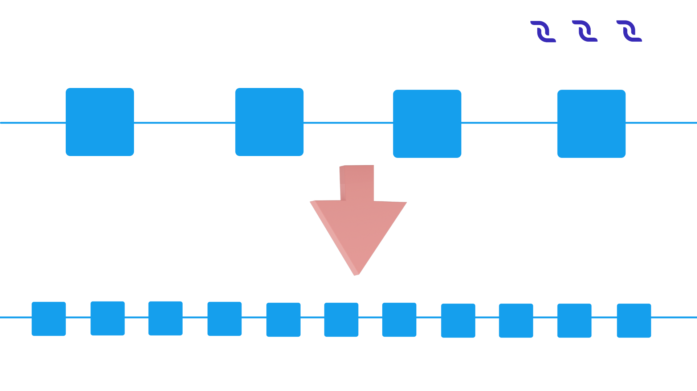
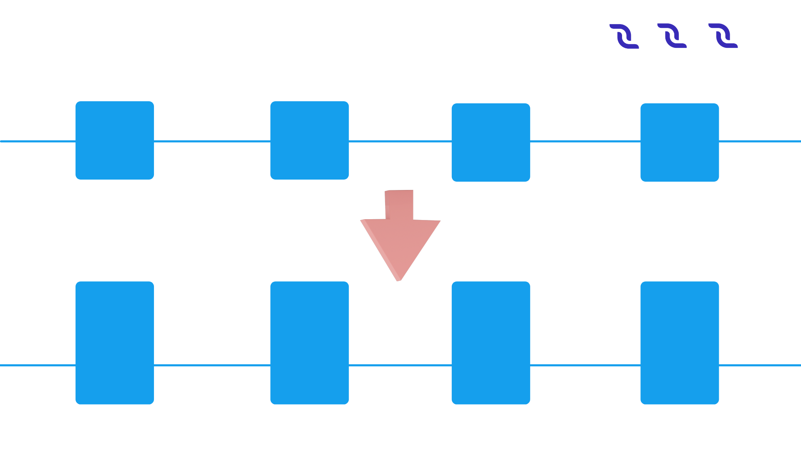
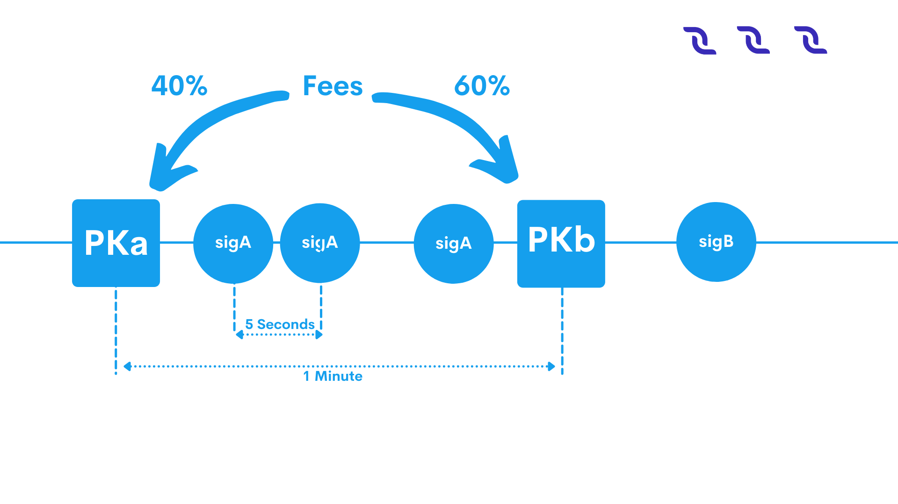

********
Protocol
********

Cryptographic Practical Details
===============================

Description
-----------

This section describes all the details of cryptographic algorithms which are used to:

* Create private and public keys from seed. 
* Create addresses from public keys.
* Create blocks and transactions signing.

We use Blake2b256 and Keccak256 algorithms (in the form of hash chain) to create cryptographic hashes. And Curve25519 (ED25519 with X25519 keys) to create and verify signatures.
Base58 to create the string form of bytes.

Bytes Encoding Base58
---------------------

All arrays of bytes in the project are encoded by Base58 algorithm with Bitcoin alphabet to make it ease human readable (text readability).

:strong:`Example`

The string teststring is coded into the bytes :math:`[5, 83, 9, -20, 82, -65, 120, -11]`. The bytes :math:`[1, 2, 3, 4, 5]` are coded into the string 7bWpTW.

Creating a Private Key From a Seed
----------------------------------

A seed string is a representation of entropy, from which you can re-create deterministically all the private keys for one wallet. It should be long enough so that the probability of selection is an unrealistic negligible.
In fact, seed should be an array of bytes but for ease of memorization lite wallet uses Brainwallet, to ensure that the seed is made up of words and easy to write down or remember. The application takes the UTF-8 bytes of the string and uses them to create keys and addresses.
For example, 

.. code-block:: none

  seed string manage manual recall harvest series desert melt police rose hollow moral pledge kitten position add

After reading this string as UTF-8 bytes and encoding them to Base58, the string will be coded as:

.. code-block:: none

  xrv7ffrv2A9g5pKSxt7gHGrPYJgRnsEMDyc4G7srbia6PhXYLDKVsDxnqsEqhAVbbko7N1tDyaSrWCZBoMyvdwaFNjWNPjKdcoZTKbKr2Vw9vu53Uf4dYpyWCyvfPbRskHfgt9q

A seed string is involved with the creation of private keys. To create a private key using the official web wallet or the node, to :math:`4` bytes of int 'nonce' field (big-endian representation), which initially has a value of :math:`0` and increases every time you create the new address, should be prepended to seed bytes. Then we use this array of bytes to calculate hash keccak256(blake2b256(bytes)). This resulting array of bytes we call account seed, from it you can definitely generate one private and public key pair. Then this bytes hash passed in the method of creating a pair of public and private key of Curve25519 algorithm.
DecentralChain uses Curve25519-ED25519 signature with X25519 keys (montgomery form), but most embedded cryptography devices and libraries don't support X25519 keys.
There are libraries with conversion functions from:

* ED25519 keys to X25519 (Curve25519) crypto_sign_ed25519_pk_to_curve25519(curve25519_pk, ed25519_pk) for public key.
* Crypto_sign_ed25519_sk_to_curve25519(curve25519_sk, ed25519_skpk) for private key.

NOTE: Not all random :math:`32` bytes can be used as private keys (but any bytes of any size can be a seed). The signature scheme for the ED25519 introduces restrictions on the keys, so create the keys only through the methods of the Curve25519 libraries and be sure to make a test of the ability to sign data with a private key and then check it with a public key, however obvious this test might seem.
There are valid Curve25519 realizations for different languages:

* `Java <https://github.com/signalapp/curve25519-java/>`_
* `C <https://github.com/signalapp/curve25519-java/tree/master/android/jni>`_
* `Python <https://github.com/tgalal/python-axolotl-curve25519>`_

Also some Curve25519 libraries (as the one used in our project) have the Sha256 hashing integrated, some not (such as most of c/c++/python libraries), so you may need to apply it manually. Note that the private key is clamped, so not any random :math:`32` bytes can be a valid private key.

:strong:`Example`

Brainwallet seed string 

.. code-block:: none

  manage manual recall harvest series desert melt police rose hollow moral pledge kitten position add

As UTF-8 bytes encoded

.. code-block:: none

  xrv7ffrv2A9g5pKSxt7gHGrPYJgRnsEMDyc4G7srbia6PhXYLDKVsDxnqsEqhAVbbko7N1tDyaSrWCZBoMyvdwaFNjWNPjKdcoZTKbKr2Vw9vu53Uf4dYpyWCyvfPbRskHfgt9q

Account seed bytes with nonce :math:`0` before apply hash function in Base58

.. code-block:: none
  
  1111xrv7ffrv2A9g5pKSxt7gHGrPYJgRnsEMDyc4G7srbia6PhXYLDKVsDxnqsEqhAVbbko7N1tDyaSrWCZBoMyvdwaFNjWNPjKdcoZTKbKr2Vw9vu53Uf4dYpyWCyvfPbRskHfgt9q

blake2b256(account seed bytes)

.. code-block:: none

  6sKMMHVLyCQN7Juih2e9tbSmeE5Hu7L8XtBRgowJQvU7

Account seed ( keccak256(blake2b256(account seed bytes)))

.. code-block:: none

  H4do9ZcPUASvtFJHvESapnxfmQ8tjBXMU7NtUARk9Jrf

Account seed after Sha256 hashing (optional, if your library does not do it yourself)

.. code-block:: none

  49mgaSSVQw6tDoZrHSr9rFySgHHXwgQbCRwFssboVLWX

Created private key

.. code-block:: none

  3kMEhU5z3v8bmer1ERFUUhW58Dtuhyo9hE5vrhjqAWYT

Created public key

.. code-block:: none

  HBqhfdFASRQ5eBBpu2y6c6KKi1az6bMx8v1JxX4iW1Q8

Creating Address from a Public Key
----------------------------------

Our network address obtained from the public key depends on the byte chainID ('T' for Testnet, 'W' for Mainnet, 'S' for Stagenet), so different networks obtained a different address for a single seed (and hence public keys).

:strong:`Example`

For the public key:

.. code-block:: none

  HBqhfdFASRQ5eBBpu2y6c6KKi1az6bMx8v1JxX4iW1Q8

Created public key:

.. code-block:: none

  3PPbMwqLtwBGcJrTA5whqJfY95GqnNnFMDX

Signing
-------

Curve25519 is used for all the signatures in the project. The process is as follows: create the special bytes for signing for transaction or block, then create a signature using these bytes and the private key bytes.
For the validation of signatures it’s enough with signature bytes, signed object bytes and the public key.
Do not forget that there are many valid (not unique!) signatures for a one array of bytes (block or transaction). Also you should not assume that the ID of the block or transaction is unique. The collision can occur one day! They have already taken place for some weak keys.

:strong:`Example`

Transaction Data:

.. csv-table:: Transaction Data
  :file: ../_static/02_decentralchain/tables/031_Signing-Transaction-Data.csv 
  :header-rows: 1 
  :class: longtable
  :widths: 1 2

Bytes:

.. csv-table:: Bytes
  :file: ../_static/02_decentralchain/tables/032_Signing-Bytes.csv 
  :header-rows: 1 
  :class: longtable
  :widths: 1 2 1 2 1 1 3

Total data bytes for sign

.. code-block:: none

  Ht7FtLJBrnukwWtywum4o1PbQSNyDWMgb4nXR5ZkV78krj9qVt17jz74XYSrKSTQe6wXuPdt3aCvmnF5hfjhnd1gyij36hN1zSDaiDg3TFi7c7RbXTHDDUbRgGajXci8PJB3iJM1tZvh8AL5wD4o4DCo1VJoKk2PUWX3cUydB7brxWGUxC6mPxKMdXefXwHeB4khwugbvcsPgk8F6YB

Signature of transaction data bytes (one of an infinite number of valid signatures)

.. code-block:: none

  2mQvQFLQYJBe9ezj7YnAQFq7k9MxZstkrbcSKpLzv7vTxUfnbvWMUyyhJAc1u3vhkLqzQphKDecHcutUrhrHt22D

Total transaction bytes with signature:

.. code-block:: none

  6zY3LYmrh981Qbzj7SRLQ2FP9EmXFpUTX9cA7bD5b7VSGmtoWxfpCrP4y5NPGou7XDYHx5oASPsUzB92aj3623SUpvc1xaaPjfLn6dCPVEa6SPjTbwvmDwMT8UVoAfdMwb7t4okLcURcZCFugf2Wc9tBGbVu7mgznLGLxooYiJmRQSeAACN8jYZVnUuXv4V7jrDJVXTFNCz1mYevnpA5RXAoehPRXKiBPJLnvVmV2Wae2TCNvweHGgknioZU6ZaixSCxM1YzY24Prv9qThszohojaWq4cRuRHwMAA5VUBvUs

Calculating Transaction ID
--------------------------

Transaction ID is not stored in the transaction bytes and for most transactions (except Payment) it can be easily calculated from the special bytes for signing using blake2b256(bytes_for_signing). For payments, the transaction ID is just the signature of this transaction.

DecentralChain-M5 Solution
==========================

Reasoning
---------

The maximum rate of transactions in blockchain systems is limited by the choice of two parameters: block size and block interval.

The block interval defines the average amount of time that passes between the creation of two blocks. If we reduce this time, forks will appear more frequently, which will lead to either non-resolved forks or to decreased throughput since a considerable amount of time would be spent on resolving these forks.
Larger blocks lead to huge network usage spikes during block propagation, which in turn will lead to throughput problems and huge forks.

DecentralChain-M5 Solution With Technical Details
^^^^^^^^^^^^^^^^^^^^^^^^^^^^^^^^^^^^^^^^^^^^^^^^^

DecentralChain addresses this issue by allowing the miner to continuously farm a block during the time of mining. This continuously increasing block is called liquid block, which becomes immutable when the next block referencing it is built and appended. A liquid block consists of a key block and chain of microblocks. The process of creating liquid block goes as follows:

* When a miner node observes it has the right to create a block, it creates and sends keyBlock, which is regularly just an empty block.
* After that, it creates and sends microblocks every :math:`3` seconds. Microblock is very similar to a regular block: it's a non-empty pack of transactions, which references its parent: previous microblock or key block.
* Microblocks are continuously mined and propagated to the network until a new key block, referencing the current liquid block appears.

Microblock Structure
^^^^^^^^^^^^^^^^^^^^

.. code-block:: none

  generator: PublicKeyAccount
  transactionData: Seq[Transaction]
  prevResBlockSig: BlockId
  totalResBlockSig: BlockId
  signature: ByteStr

totalResBlockSigis the new total signature of a block with all transactions from blockId=prevResBlockSigand owntransactionData. This means that having a_liquid block_consisting of 1_keyblock_and 3_microblock_s:
KEYBLOCK() <-MICRO1(tx1,tx2) <-MICRO2(tx3,tx4) <-MICRO3(tx5,tx6)
We have 4 versions of last block:

.. csv-table:: Microblock Structure
  :file: ../_static/02_decentralchain/tables/033_Microblock-Structure.csv 
  :header-rows: 1 
  :class: longtable
  :widths: 1 1

Next miner can reference any of these ids in its keyBlock.

Economy
-------

For a miner, it might seem a good idea to reference KEYBLOCK from previous example and pack all txs from microblocks to its own (micro)block(s). In order to make 'stealing' transactions less profitable than referencing the best-known version of liquid block(= the last known microblock), we change the mechanics of fees: After activating M5, miner will receive :math:`40\%` of fees from the block it creates and  :math:`60\%` of fees from the block he references.

Related Protocol Changes
------------------------

* A block can contain up to :math:`65535` transactions and doesn't require transaction sorting.
* By default miners will first create an empty key block. It's a regular block, propagated byBlockForgedmessage, but it now gets broadcasted if it's empty.
* Microblocks are propagated by broadcasting its header for every node which applied it (MicroBlockInv)MicroBlockInv contains a verifiable signature to prevent a node from being flooded. Microblock will be requested afterward via MicroBlockRequestand received back withinMicroBlockResponse.Microblocks will be re-requested from another node which has it if a node doesn't respond.

Configuration
-------------
The following miner parameters can be tuned(though it's best not to change them in order to maximize final version of your liquid block in the resulting blockchain):

* KeyBlock size (maxTransactionsInKeyBlock, default = :math:`0`). If changed, it won't be rebroadcasted and the usual extension requesting mechanics will be used.
* Microblock mining interval (microBlockInterval, default = :math:`3` s).
* Max amount of transactions per microblock (maxTransactionsInMicroBlock, default = :math:`200`).
* Miner will try to reference the best-known microblock with at leastminMicroBlockAgeage(default = :math:`3` s). This is required in order for a miner to reference already-propagated block so its key block doesn't get orphaned.
* Microblock synchronization mechanism can be tuned with waitResponseTimeout(default = :math:`2` s), processedMicroBlocksCacheTimeout(default = :math:`10` s),invCacheTimeout(default = :math:`10` s) which are basically time of awaiting a microblock and times to cache a processed microblock ids and a list of nodes which have a microblock(by id).

API changes
-----------

* Upon applying every microblock, the last block gets changed, which means/blocks/lastand/blocks/at/...will reflect that.
* /peers/blacklistednow expose ban reason, one can clear a node's blacklist via/peers/clearblacklist
* /debug/and/consensus/section are expanded, _stateHash _doesn't take _liquid block _into consideration.

DecentralChain-M5 Protocol
==========================

Scalability Limits and Challenges in Current Blockchain Systems
---------------------------------------------------------------

Problem Statement and Motivation
^^^^^^^^^^^^^^^^^^^^^^^^^^^^^^^^

Blockchains protocols have some scalability limits and challenges that tradeoff between throughput and latency. The current blockchain technology is not fast enough and does not scale to include more transactions into the system so we have a performance challenge to be considered.
There is a united agreement between miners, consumers, and developers with several perspectives that we need to deploy scalability measures, and there has been an ongoing argument on how to improve Bitcoin’s scalability. Current proposals have focused on how big to make the blocks and how to handle the block size increases in the future.

All proposals suffer from a major scalability bottleneck:
No matter what block size is chosen, the blockchain system can at best reach a proper transaction throughput, increasing from ~ :math:`3` transactions per second to ~ :math:`7` transactions per second. This is so far from the :math:`30,000` transactions per second which are necessary to compete with the existing systems such as VISA transactions. The same major limitations apply to litecoin, Ethereum, and all other currencies that share Bitcoin’s blockchain protocol.

DecentralChain-M5 will address the scalability bottleneck by making the network reach the highest throughput depending on the network conditions. It will not only enhance the transaction throughput, it will also reduce transaction latencies. So it will be possible to get an initial transaction confirmation in seconds rather than in minutes.

Weaknesses of Current Proposals to Improve Scalability
^^^^^^^^^^^^^^^^^^^^^^^^^^^^^^^^^^^^^^^^^^^^^^^^^^^^^^

Blockchain Systems can process transactions and the maximum rate of these transactions is limited by the choice of two parameters: block size and block interval.

* The block interval defines the average amount of time that passes between the creation of two blocks. By deciding to reduce the block interval to solve the latency limit, the system will have less security (increase forks probability) due to the reason of new miners for every second which will lead to instability where the blockchain is subject to reorganization and the system is in disagreement (Figure 1). If we reduce the time per block, then we will have a situation where a significant number of blocks are solved in less time than it takes to relay a solved block throughout the network. So there will be no way to know which block is the "real" one and which one is a "fork" because the transactions that appeared to have multiple confirmations suddenly have fewer confirmations (or possibly go back to being unconfirmed).

Figure 1: Increasing block frequency with static block size will result in less security.

* The throughput of a system is bounded by the maximum block size (given a fixed block interval), as the maximum number of included transactions is directly dependent on the block size. 
* Larger blocks do however cause slower propagation speeds, which causes more discarded blocks (orphaning risk). An unlimited blocksize could, for example, result in a DoS attack on the system by creating a block that takes a long time to validate. If the choice is to Increase block size in order to improve throughput, there will be Network spikes with longer time to propagate in the network (Figure 2).

Figure 2: Increasing block size with Static block frequency will lead to more discarded blocks and network spikes.

Brief Summary of Bitcoin-M5
^^^^^^^^^^^^^^^^^^^^^^^^^^^

It is a next-generation blockchain protocol which is an alternative bitcoin scaling solution that does not involve increasing the size of blocks or decreasing the block time interval. This reduces the risk of forks amongst other advantages. Bitcoin-M5 describes that the basic tradeoffs in Bitcoin can be reduced with an alternative blockchain protocol, offering a consensus delay and bandwidth limited only by the Network Plane. The protocol splits time into time periods(epoch). In each time period, a particular leader is responsible for serializing transactions (Figure 3). The leaders take the rule of generating blocks:

* Key blocks for the election of a leader.
* Micro blocks for ledger records.

.. image:: ../_static/02_decentralchain/images/14_Brief-Summary-of-Bitcoin-M5.png

Figure 3: Bitcoin-M5 time periods structure with serializing transactions.

DecentralChain-M5 Overlay
-------------------------

DecentralChain-M5 is based on the bitcoin next generation protocol that serializes transactions and offers important improvements in the transaction latency(lower latency) and bandwidth(higher throughput) in comparison to Bitcoin without sacrificing other properties.
DecentralChain approaches this scalability matter by providing the miner with the ability to farm a block during the time of mining in a continuous approach. This block continues increments called liquid blocks. This liquid block is unchangeable over time once the next block referencing is created and appended.
This approach increases effective bandwidth and speed of block creation, which is described as being “especially significant for businesses” using the DecentralChain-M5 protocol since it allows for conducting micro-transactions - without any delays that are typical with traditional blockchain systems.
Furthermore, it allows the blockchain to withstand high loads, such as distribution of tokens following crowdsales and airdrops of bonus tokens. The speed of processing trading transactions on the exchange gets increased as well.

DecentralChain-M5 Operations
^^^^^^^^^^^^^^^^^^^^^^^^^^^^

The main and core idea of DecentralChain-M5 is to split the Liquid block into two types, Key blocks and Micro blocks. The process of creating liquid block works as follows:

* The miner node gets the permission to create a block.
* The miner node creates and sends the key block (which does not contain transactions).
* The miner node creates and sends the micro blocks (which contain transactions just as in normal blocks with a reference to previous micro blocks or key blocks) with a mining time interval of three seconds.
* Miners will mine those micro blocks and propagate them directly to the network until the next new key block appears with a reference to the liquid block.

All of the transactions are part of the same block and are contributed all together. In between blocks, the traditional Bitcoin system appears idle to an onlooker, as miners are working to discover the next block, but without apparent progress on the consensus front.
In contradiction, in DecentralChain-M5, the key-blocks can be small because they need to contain only the coinbase transaction, which defines the public key that the miner will be using to sign microblocks.
Because a key-block requires proof of stake, miners can not just produce one and expropriate the leadership at will.
Following the key-block, the lead miner can quickly issue microblocks, simply by signing them with the private key corresponding to the public key named in the key-block’s coinbase (Figure 4).

.. image:: ../_static/02_decentralchain/images/15_DecentralChain-M5-Operations.png

Figure 4: Key-blocks and Micro-blocks signing process.

:strong:`Leader Blocks`

They’re also called "Key Blocks", these blocks are generated with proof of stake but do not contain transactions.
They serve as a leader election mechanism and contain a public key that identifies the chosen leader.
Each block has a header that contains, among other fields, the unique reference of its predecessor which is a cryptographic hash of the predecessor header (either a key block or a microblock).

:strong:`Micro Blocks`

Once a node generates a key block it becomes the leader. As a leader, the node is allowed to generate microblocks at a set rate smaller than a predefined maximum.
These micro blocks will contain the ledger entries with no requirement for any Proof of Stake and they're generated by the elected leader in every block-generation cycle.
This block-generation cycle is initiated by a leader block.
The only requirement is to sign the micro blocks with the elected leader's private key.
The micro blocks can be generated at a very high speed by the elected leader(miner), thus resulting in increased performance and transaction speed.

For a microblock to be valid, all its entries must be valid according to the specification of the state machine, and the signature has to be valid. Figure 5 illustrates the structure.
Note that microblocks do not affect the weight of the chain, as they do not contain proof of stake.
When all micro blocks have been validated, they will be merged with their key block into one block.

DecentralChain-M5 Reward Mechanisms
^^^^^^^^^^^^^^^^^^^^^^^^^^^^^^^^^^^

Remuneration consists of two parts. First, each key block entitles its generator a set amount. Second, each ledger entry carries a fee.
This fee is split by the leader that places this entry in a microblock and the subsequent leader that generates the next key block.

In order to motivate participants to follow the protocol, DecentralChain-M5 uses the following mechanisms:
Each transaction pays a fee to the system, but unlike Bitcoin, this fee is distributed, with :math:`40\%` to the leader, and :math:`60\%` to the subsequent leader.
Finally, if a leader forks the chain by generating two microblocks with the same parent, it is punished by revoking the subsidy revenue; whoever detects the fraud wins a nominal fee, (Figure 5).

Figure 5: chain structure of the DecentralChain-M5 Protocol. Microblocks (circles) are signed with the private key matching with the public key in the last key block (squares). The fee is distributed  :math:`40\%` to the leader and :math:`60\%` to the next one.

In practice, the remuneration is implemented by having each key block contain a single coinbase transaction that mints new coins and deposits the funds to the current and previous leaders.
As in Bitcoin, this transaction can only be spent after a maturity period of :math:`100` key blocks, to avoid non-mergeable transactions following a fork.

Fair Proof of Stake
===================

In this model, the choice of account that has the right to generate the next block and receive the corresponding transaction fees is based on the number of tokens in the account. The more tokens that are held in the account, the greater the chance that account will earn the right to generate a block.

In DecentralChain, we are convinced that each participant in the blockchain should participate in the block generation process proportionally to his stake: we have decided to correct the PoS formula. At the moment we do not have the goal of completely changing the algorithm, since there is no need; we simply want to make some adjustments.
We presented an improved PoS algorithm that makes the choice of block creator fair and reduces vulnerability to the multi-branching attacks, in accordance with the shortcomings of the current algorithm. 

We analyzed the model of the new algorithm for its correspondence to the stake share and the share of blocks, and the results were positive. Also, the algorithm was analyzed for vulnerability to attacks, and results obtained with the new model were better than with the old one. The attacks’ results for the attacker were not so successful in terms of the profits gained. The number of forks and their length decreased.

Blockchain Data Types
=====================

The blockchain data types are the data types that are used to describe 02_decentralchain of blockchain entities. Here’s a list of blockchain data types:

.. csv-table:: Blockchain Data Types
  :file: ../_static/02_decentralchain/tables/034_Blockchain-Data-Types.csv 
  :header-rows: 1 
  :class: longtable
  :widths: 1 1 4 2

Validation Rules
================

Account Validation
------------------

Account is valid then it is a valid Base58 string and the length of the corresponding array is :math:`26` bytes. Version of address (1st byte) is equal to :math:`1`. The network byte (2nd byte) is equal to network ID. The checksum of address (last :math:`4` bytes) is correct.

Transactions Validation
-----------------------

Transfer Transaction Validation
^^^^^^^^^^^^^^^^^^^^^^^^^^^^^^^

Transfer transaction is valid then:

* Recipient address is valid. If not, InvalidAddress validation result will be returned.
* Size of attachment is less than or equals MaxAttachementSize(:math:`140` bytes). In other case TooBigArray validation result will be returned.
* Transaction's amount is more than :math:`0`, otherwise NegativeAmount validation result is returned.
* Transaction's fee is positive, otherwise InsufficientFee validation result is returned.
* Adding fee to amount does not lead to Long overflow. In case of Long overflow OverflowError validation result will be returned.
* Transaction's signature is valid, otherwise InvalidSignature validation result is returned.

Issue Transaction Validation
^^^^^^^^^^^^^^^^^^^^^^^^^^^^

Issue transaction is valid then:

* Sender's address is valid. If not, InvalidAddress validation result will be returned.
* Quantity of asset is positive, otherwise NegativeAmount validation result is returned.
* Transaction's fee is more than or equals MinFee(:math:`100000000` Decentralites = :math:`1` DecentralCoin), in other case InsufficientFee validation result is returned.
* Size of description is less than or equals MaxDescriptionLength(:math:`1000` bytes), otherwise TooBigArray is returned.
* Size of name is more than or equals MinAssetNameLength and less or equals MaxAssetNameLength, in other case InvalidName validation result will be returned.
* Decimals is positive and less than or equals MaxDecimals, in other case TooBigArray is returned.
* Transaction's signature is valid, otherwise InvalidSignature validation result is returned.

Reissue Transaction Validation
^^^^^^^^^^^^^^^^^^^^^^^^^^^^^^

Reissue transaction is valid then:

* Sender's account is valid. Otherwise InvalidAddress validation result is returned.
* Quantity is positive, in other case NegativeAmount validation result will be returned.
* Transaction's fee is positive, in other case InsufficientFee result will be returned.
* Transaction's signature is valid, otherwise InvalidSignature validation result is returned.

Block Validations
-----------------

Block is valid then:

* Block chain contains referenced blocks.
* Block's signature is valid.
* Block's consensus data is valid.
* Block's transactions are valid.

Consensus Data Validation
^^^^^^^^^^^^^^^^^^^^^^^^^

Block's consensus data is valid then:

* Block creation time is no more than MaxTimeDrift(:math:`15` seconds) in future.
* Block's transactions are sorted. This rule works only after :math:`1477958400000` on Testnet and :math:`1479168000000` on Mainnet.
* Block chain contains parent block or block chain height is equal :math:`1`.
* Block's base target is valid.
* Block's generator signature is valid.
* Generator's balance is more than or equals MinimalEffectiveBalanceForGeneration(:math:`1000000000000` Decentralites). This rule always works on Testnet and works only after :math:`1479168000000` on Mainnet.
* Block's hit is less than calculated block's target.
* Voted features are sorted in ascending order and are not repeated.

Transactions Data Validation
^^^^^^^^^^^^^^^^^^^^^^^^^^^^

Block's transactions are valid then:

* Creation time of every transaction in block is less than block's creation time no more than on MaxTxAndBlockDiff(:math:`2` hours).
* All transactions are valid against state.

Transaction validation against state. Transactions are valid then:

* Transaction is valid by transaction validation rules.
* Transaction creation time more than block's creation time no more than on MaxTimeForUnconfirmed(:math:`90` minutes). This limitation works always on Testnet and only after :math:`1479168000000` on Mainnet.
* Application of transaction to accounts should not lead to temporary negative balance. This rule works after :math:`1479168000000` on Mainnet and after :math:`1477958400000` on Testnet.
* Changes made by transaction should be sorted by their amount. This rule works on both Mainnet and Testnet after :math:`1479416400000`.
* Application of transaction's amount to current balance should not lead to Long overflow.
* After application of all block's transactions affected balances should not be negative.

Unconfirmed Transactions Pool Validation
----------------------------------------

Transaction could be inserted in unconfirmed transactions pool then:

* Transaction is valid by transaction validation rules.
* If transaction's fee is more than or equals minimum fee that was set by the owner of a node.
* There is a space for a new transaction if unconfirmed transactions pool. By default the pool is limited by :math:`1000` transactions.
* unconfirmed transactions pool does not contain transaction with the same ID.
* Transaction created not later than MaxTimeForUncofimed(:math:`90` minutes) after the last block was created.
* Transaction creation time is no more than MaxTimeDrift(:math:`15` seconds) in future.
* Transaction is valid against state.