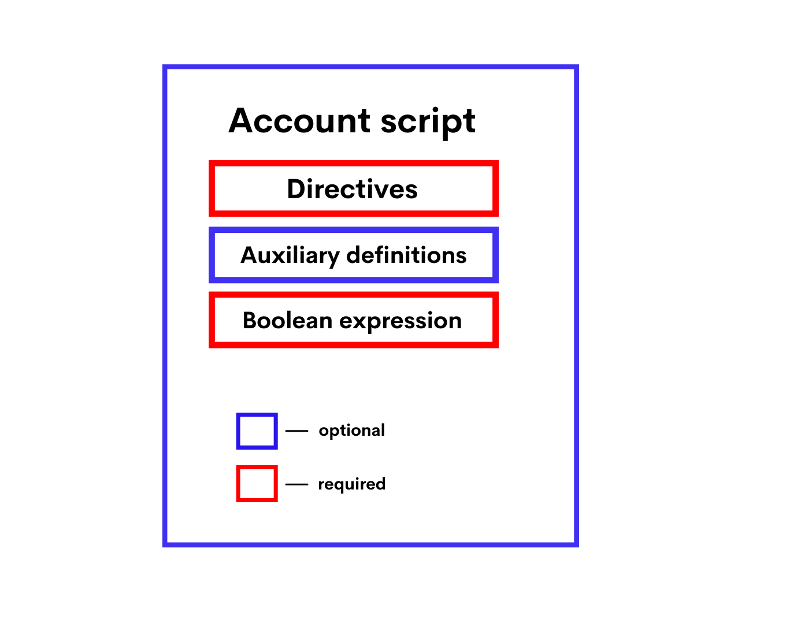

************
Script Types
************

There are three types of scripts:

* :ref:`dApp script <03_ride-language/04_script-types:dApp Script>` enables you to define :ref:`сallable functions <03_ride-language/03_functions:Callable Functions>` that can be called from other accounts, accept payments to the dApp, and perform various actions on the blockchain. Also dApp script can comprise a verifier function that allows or denies transactions and orders that are sent on behalf of the dApp account.
* :ref:`Account script <03_ride-language/04_script-types:Account Script>` allows or denies transactions and orders that are sent on behalf of the account (like a verifier function of a dApp script).
* :ref:`Asset script <03_ride-language/04_script-types:Asset Script>` allows or denies transactions involving the asset.

Features of each script type are described in the table.

.. csv-table:: Script Types
  :file: ../_static/03_ride-language/tables/161_Script-Types.csv
  :header-rows: 1 
  :class: longtable
  :widths: 1 4 2 2

dApp Script
===========

dApp script enables you to define callable functions that can be called from other accounts by sending an :ref:`invoke script transaction <02_decentralchain/03_transaction:Invoke Script Transaction>` or by a :ref:`dApp-to-dApp invocation <03_ride-language/07_dapp-to-app-invocation:dApp-to-App Invocation>`.
Callable functions can accept payments to the dApp and perform various actions on the blockchain. Also dApp script can comprise a verifier function that allows or denies transactions and orders that are sent on behalf of the dApp account. An account with a dApp script assigned to it is called a dApp. 

dApp Script Format
------------------

The script code is composed of the following parts:

* :ref:`Directives <03_ride-language/04_script-types:Directives>`
* :ref:`Auxiliary definitions <03_ride-language/04_script-types:Auxiliary definitions>`
* :ref:`Callable function <03_ride-language/04_script-types:Callable function>`
* :ref:`Verifier function <03_ride-language/04_script-types:Verifier function>`

.. image:: ../_static/03_ride-language/images/01_dApp-Script-Format.png

Directives
^^^^^^^^^^

The dApp script should start with directives:

.. code-block:: none

 {-# STDLIB_VERSION 5 #-}
 {-# CONTENT_TYPE DAPP #-}
 {-# SCRIPT_TYPE ACCOUNT #-}

The above directives tell the compiler that:

* The script uses the standard library version 5.
* The script contains a set of definitions.
* The script will be assigned to an account (not asset).

Auxiliary definitions
^^^^^^^^^^^^^^^^^^^^^

After the directives, you can define auxiliary variables and functions. These variables and functions are accessible within the entire script. Please note that functions without annotations cannot be called from other accounts. Let's see an exaxmple:

.. code-block:: none

 let someConstant = 42
 func doSomething() = {
  1+1
 }

Callable Functions (dApp Script)
^^^^^^^^^^^^^^^^^^^^^^^^^^^^^^^^

The callable function should be marked with the @Callable(i) annotation, where i is an :ref:`invocation <03_ride-language/05_structures:Invocation>` structure that contains fields of the script invocation that are accessible to the callable function. The variable name in the annotation is required even if the function does not use it. 
Callable function result is a set of :ref:`script actions <03_ride-language/05_structures:Script Actions>` that are performed on the blockchain: adding/deleting/modifying entries to the account data storages, token transfers, issue/reissue/burning, and others. The result format and the available actions depend on the Standard library version used.
For a detailed description, see the :ref:`callable function <03_ride-language/03_functions:Callable Functions>` article.

In the example below the callable function transfers 1 DecentralCoin to an account that called it and records the request information in the account data storage. If the same account tries to call the function again, the callable function throws an exception.

.. code-block:: none

 @Callable(i)
 func faucet () = {
  let isKnownCaller =  match getBoolean(this, toBase58String(i.caller.bytes)) {
    case hist: Boolean =>
      hist
    case _ =>
      false
  }
  if (!isKnownCaller) then 
  (
    [
      BooleanEntry(toBase58String(i.caller.bytes), true),
      ScriptTransfer(i.caller, 100000000, unit)
    ],
    unit
  )
  else throw("Can be used only once")
 }

Verifier Function
^^^^^^^^^^^^^^^^^

Verifier function checks transactions and orders that are sent on behalf of the dApp account for compliance with the specified conditions (in other words it works similar to the account script).
The verifier function should be marked with the @Verifier(tx) annotation, where tx is the transaction or the order that the function is currently checking. The variable name in the annotation is required even if the function does not use it.
The verifier function has no arguments.Possible results of the verifier function are:

* True (the transaction or the order is allowed),
* False (the transaction or the order is denied),
* An error (the transaction or the order is denied).

For a detailed description, see verifier function the article.
Using the :ref:`match ... case <03_ride-language/01_syntax-basics:Match-Case>` operator, you can set up different conditions depending on the type of the transaction/order. For example, the following function allows :ref:`transfer transactions <02_decentralchain/03_transaction:Transfer Transaction>` and denies orders and other types of transactions.

.. code-block:: none

 @Verifier(tx)
 func verify() = {
  match tx {
    case ttx:TransferTransaction => sigVerify(ttx.bodyBytes, ttx.proofs[0], ttx.senderPublicKey)
    case _ => false
  }
 }

dApp script that has no verifier function performs default verification, that is, checking that the transaction or the order is indeed signed by this account.

Failed Transactions
-------------------

If the callable function failed or threw an :ref:`exception <03_ride-language/01_syntax-basics:Exceptions>` when a block generator adds the transaction to a block, such a transaction is saved on the blockchain and marked with the attribute "applicationStatus": "script_execution_failed", provided that: There are two annotations: @Callable(i) and @Verifier(tx). The variable name in the annotation is required even if the function does not use it.
An annotated function cannot be called inside a dApp script.

* The :ref:`invoke script transaction <02_decentralchain/03_transaction:Invoke Script Transaction>` passed the sender signature verification or the account script verification.
* The complexity of performed computations exceeded the :ref:`threshold for saving failed transactions <03_ride-language/07_dapp-to-app-invocation:Limitations>`.

The transaction sender is charged a fee. The transaction doesn't entail any other changes on the blockchain.

Data Accessible to dApp Script
------------------------------

Data accessible to the callable function:

* Particular fields of the invocation, including payments, fee, sender address and public key. See the :ref:`invocation <03_ride-language/05_structures:Invocation>` article for the fields description. Proofs are inaccessible.
* Blockchain data: current height, account balances, entries in account data storages, parameters of tokens, etc.

Data accessible to the verifier function:

* Fields of the current verified transaction/order, including proofs. The built-in variable tx contains this transaction or order. The set of fields depends on the type of transaction/order, see the :ref:`transaction structures <03_ride-language/05_structures:Transaction Structures>` chapter and :ref:`order <03_ride-language/05_structures:Order>` article.
* Blockchain data: current height, account balances, entries in account data storages, parameters of tokens, etc.

Annotations
-----------

Annotation is a form of metadata that is added to a :ref:`function :ref:`functions <03_ride-language/03_functions:Functions>` of a :ref:`dApp script <03_ride-language/04_script-types:dApp Script>`. At the present moment, there are two annotations: @Callable(i) and @Verifier(tx). The variable name in the annotation is required even if the function does not use it.
An annotated function cannot be called inside a dApp script.

@Callable(i)
^^^^^^^^^^^^

Annotation of a :ref:`callable function <03_ride-language/03_functions:Callable Functions>`.
Variable i contains an :ref:`invocation <03_ride-language/05_structures:Invocation>` structure representing certain fields of the invocation.

@Verifier(tx)
^^^^^^^^^^^^^

Annotation of a verifier function.
Variable tx contains a structure of transaction or :ref:`order <03_ride-language/05_structures:Order>` sent from a dApp's account.

Callable Function
------------------

Callable function is a :ref:`dApp script <03_ride-language/04_script-types:dApp Script>` function which can be invoked by a :ref:`invoke script transaction <02_decentralchain/03_transaction:Invoke Script Transaction>` or an invoke or reentrantInvoke functions (see details in the :ref:`dApp-to-dApp invocation functions <03_ride-language/03_functions:dApp-to-dApp Invocation Functions>` article).

* Add, modify, delete dApp :ref:`account data storage <02_decentralchain/01_account:Account Data Storage>` entries.
* Transfer tokens.
* Add, modify, delete dApp.
* Issue tokens on behalf of the dApp, reissue and burn tokens.
* Setup :ref:`sponsorship <02_decentralchain/03_transaction:How to Enable Sponsorship>`.
* Lease, cancel lease.

The callable function can return a value that is passed to the invoking function in case of the :ref:`dApp-to-dApp invocation <03_ride-language/07_dapp-to-app-invocation:dApp-to-App Invocation>`.
The invocation can contain payments to dApp. Tokens obtained in these payments can be used in script actions performed by the callable function and in payments attached to nested invocations.

Annotation
^^^^^^^^^^

The callable function should be marked with the @Callable(i) annotation, where i is an :ref:`invocation <03_ride-language/05_structures:Invocation>` structure that contains invocation fields that are available to the callable function. The variable name in the annotation is required even if the callable function does not use it.

Arguments
^^^^^^^^^

The callable function can have arguments of the following types:

* The script uses the standard library version 5.
* :ref:`Boolean <03_ride-language/02_data-types:Boolean>`
* :ref:`ByteVector <03_ride-language/02_data-types:ByteVector>`
* :ref:`Int <03_ride-language/02_data-types:Int>`
* :ref:`String <03_ride-language/02_data-types:String>`
* :ref:`Union <03_ride-language/02_data-types:Union>` with elements having types listed above.
* :ref:`List <03_ride-language/02_data-types:List>` with elements having types listed above.

Invocation Result
^^^^^^^^^^^^^^^^^

The callable function invocation result is a :ref:`tuple <03_ride-language/02_data-types:Tuple>` of two elements:
List of script actions. Actions are executed in the same order as the elements in the list.
Return value that is passed to the invoking function in case of the :ref:`dApp-to-dApp invocation <03_ride-language/07_dapp-to-app-invocation:dApp-to-App Invocation>`.

Let's see an example of invocation of an invocation result:

.. code-block:: none

  (
    [
      BooleanEntry("key1", true),
      IntegerEntry("key2", 42),
      StringEntry("key3", "some string"),
      BinaryEntry("key4", base58'encoded'),
      DeleteEntry("key5"),
      ScriptTransfer(Address(base58'3Ms8fSfAxBLDjKvNVgACRzQoBLCtCWxtawu'), 100, base58'someAssetid'),
      Issue("RegularToken", "This is an ordinary token", 10000, 2, true),
      Reissue("4ZzED8WJXsvuo2MEm2BmZ87Azw8Sx7TVC6ufSUA5LyTV", 1000, true),
      Burn("4ZzED8WJXsvuo2MEm2BmZ87Azw8Sx7TVC6ufSUA5LyTV", 1000)]
      SponsorFee("4ZzED8WJXsvuo2MEm2BmZ87Azw8Sx7TVC6ufSUA5LyTV", 300),
      Lease(Address(base58'3Mn5hzck8nYd52Ytd2ZjzoiQLVoMcn1VAs9',1000),
      LeaseCancel(base58'Pxaf8pGKHS5ufGhqjmwRRcHQtC9T3h4d1XaJMnkhR1Vt')
    ],
    42
  )

Script Actions (Callable Function)
^^^^^^^^^^^^^^^^^^^^^^^^^^^^^^^^^^

Script actions performed by the callable function are set by Ride structures.

.. csv-table:: Script Actions (Callable Function)
  :file: ../_static/03_ride-language/tables/162_Script-Actions-(Callable-Function).csv
  :header-rows: 1 
  :class: longtable
  :widths: 1 5

Limitations  (Callable Function)
^^^^^^^^^^^^^^^^^^^^^^^^^^^^^^^^

* The maximum total number of Issue, Reissue, Burn, SponsorFee, ScriptTransfer, Lease, LeaseCancelscript actions executed by all callable functions in a single transaction is :math:`30`.
* The maximum total number of BinaryEntry, BooleanEntry, IntegerEntry, StringEntry, DeleteEntryscript actions executed by all callable functions in a single transaction is :math:`100`.
* The maximum number of the payments to dApp in invocation is :math:`10`.

See also the :ref:`limitations <03_ride-language/07_dapp-to-app-invocation:Limitations>` article.

Threshold for Saving Failed Transactions
^^^^^^^^^^^^^^^^^^^^^^^^^^^^^^^^^^^^^^^^

The Invoke Script transaction is saved on the blockchain and a fee is charged for it even if the dApp script or the asset script fails when a block generator adds the transaction to a block, provided that the sender's signature or account script verification passed.

However, if the callable function failed or :ref:`threw an exception <03_ride-language/01_syntax-basics:Exceptions>` before the :ref:`complexity <03_ride-language/07_dapp-to-app-invocation:Script Complexity>` of performed calculations exceeded the :ref:`threshold for saving failed transactions <03_ride-language/07_dapp-to-app-invocation:Limitations>`, the transaction is discarded and the fee is not charged.

Example
^^^^^^^

The example listed below is a wallet application which allows sending DecentralCoins to a certain address and withdrawing them (withdrawing others' DecentralCoins is prevented). There are two callable functions in the example(deposit and withdraw):
 
.. code-block:: none

 {-# STDLIB_VERSION 5 #-}
 {-# CONTENT_TYPE DAPP #-}
 {-# SCRIPT_TYPE ACCOUNT #-}

 @Callable(i)
 func deposit() = {
  let pmt =
    if i.payments.size() == 1 then
      i.payments[0]
    else throw("Attached payment is required")
  if (isDefined(pmt.assetId))
    then throw("Works with DecentralCoins only")
    else {
      let currentKey = toBase58String(i.caller.bytes)
      let currentAmount = match getInteger(this, currentKey) {
        case a:Int => a
        case _ => 0
      }
      let newAmount = currentAmount + pmt.amount
      (
        [
          IntegerEntry(currentKey, newAmount)
        ],
        unit
      )
    }
 }

 @Callable(i)
 func withdraw(amount: Int) = {
  let currentKey = toBase58String(i.caller.bytes)
  let currentAmount = match getInteger(this, currentKey) {
    case a:Int => a
    case _ => 0
  }
  let newAmount = currentAmount - amount
  if (amount < 0)
    then throw("Can't withdraw negative amount")
    else if (newAmount < 0)
      then throw("Not enough balance")
      else (
        [
          IntegerEntry(currentKey, newAmount),
          ScriptTransfer(i.caller, amount, unit)
        ],
        unit
      )
 }

 @Verifier(tx)
 func verify() = false

Verifier Function
-----------------

Verifier function is a function of :ref:`dApp script <03_ride-language/04_script-types:dApp Script>` that is responsible for :ref:`verification of transactions <02_decentralchain/03_transaction:Transaction Validation>` and orders sent from a :ref:`dApp <02_decentralchain/01_account:dApp and Smart Account>` account. The verifier function does the same as an :ref:`account script <03_ride-language/04_script-types:Account Script>`.
dApp script can have only one verifier function. The verifier function should be adorned with the @Verifier(tx) annotation, where tx: Transaction|Order is the transaction or the order that the function is currently checking.
Verifier function has no arguments.
Verifier function can have one of the following execution results:

* True (the transaction or the order is allowed).
* False (the transaction or the order is denied).
* an error (the transaction or the order is denied).

dApp that has no verifier function performs default verification, that is, checking that the first proof of the transaction/order has the correct sender's signature. The following function does the same as the default implementation:

.. code-block:: none

 @Verifier(tx)
 func verify() = {
  sigVerify(tx.bodyBytes, tx.proofs[0], tx.senderPublicKey)
 }

If the verifier function is defined, only verification by this function is performed, proofs are not checked additionally.

Example
^^^^^^^

dApp with the verifier function listed below only allows :ref:`transfer transaction <02_decentralchain/03_transaction:Transfer Transaction>` with an amount of token lower than 100. Orders and other transactions are denied. The match operator is used to specify verification rules depending on the type of the transaction/order.
 
.. code-block:: none
  
 @Verifier(tx)
 func verify() = {
    match tx {
      case ttx:TransferTransaction => ttx.amount < 100 && sigVerify(ttx.bodyBytes, ttx.proofs[0], ttx.senderPublicKey)
      case _ => false
    }
 }

See available fields for each transaction type in the :ref:`transaction structures <03_ride-language/05_structures:Transaction Structures>` article.

Account Script
==============

Account script verifies transactions and orders that are sent on behalf of the account. That is, the account script allows or denies the transaction or the order depending on whether it meets the specified conditions.

Account Script Format
---------------------

The script code is composed of the following parts:

* Directives
* Auxiliary definitions
* Boolean expression

Directives
^^^^^^^^^^

The account script should start with directives:

.. code-block:: none

 {- # STDLIB_VERSION 5 # -}
 {- # CONTENT_TYPE EXPRESSION # -}
 {- # SCRIPT_TYPE ACCOUNT # -}

The above directives tell the compiler that:

* The script uses the standard library version 5.
* The script contains a boolean expression.
* The script will be assigned to an account (not asset).

Auxiliary Definitions
^^^^^^^^^^^^^^^^^^^^^

After the directives, you can define auxiliary variables and functions. Let's see an example:

.. code-block:: none

 let someConstant = 42
 func doSomething () = {
  height + someConstant
 }

Boolean Expression
^^^^^^^^^^^^^^^^^^

The expression checks transactions and orders that are sent on behalf of the account for compliance with the specified conditions. If the conditions are not met, the transaction/order is denied. Possible results of evaluating the expression are:

* True (the transaction or the order is allowed),
* False (the transaction or the order is denied),
* An error (the transaction or the order is denied).

Using the :ref:`match ... case <03_ride-language/01_syntax-basics:Match-Case>`, you can set up different conditions depending on the type of the transaction/order. For example, the following expression prohibits sending orders and changing the account script, and allows other transactions, provided that the array of confirmations (proofs) contains the correct signature of the account at position :math:`0`:

.. code-block:: none

 match tx {
  case t: Order | SetScriptTransaction => false
  case _ => sigVerify (tx.bodyBytes, tx.proofs [0], tx.senderPublicKey)
 }

Data Accessible to Account Script
---------------------------------

The following data can be used for checks:

* Fields of the current verified transaction/order, including proofs. The built-in variable tx contains this transaction or order. The set of fields depends on the type of transaction/order, see the :ref:`transaction structures <03_ride-language/05_structures:Transaction Structures>` chapter and :ref:`order <03_ride-language/05_structures:Order>` article.
* Blockchain data: current height, account balances, entries in account data storages, parameters of tokens, etc.

Asset Script
============

Asset script verifies transactions within the :ref:`asset (token) <02_decentralchain/02_token(asset):Token (Asset)>`, that is, allows or denies the transaction depending on the specified conditions. Asset with a script assigned to it is called a :ref:`smart asset <02_decentralchain/02_token(asset):Smart Asset>`.
Keep the following in mind:

* The asset script can only verify transactions, but not orders.
* If a token is issued without a script, then the script cannot be added later.
* The script cannot be removed, so it is impossible to turn a smart asset into a regular one.
* Smart asset cannot be a sponsored asset.

Asset Script Format
-------------------

The script code is composed of the following parts:

* Directives
* Auxiliary definitions
* Boolean expression

.. image:: ../_static/03_ride-language/images/03_Asset-Script-Format.png

Directives
^^^^^^^^^^

The asset script should start with directives:

.. code-block:: none

 {- # STDLIB_VERSION 5 # -}
 {- # CONTENT_TYPE EXPRESSION # -}
 {- # SCRIPT_TYPE ACCOUNT # -}

The above directives tell the compiler that:

* The script uses the standard library version 5.
* The script contains a boolean expression.
* The script will be assigned to an asset.

Auxiliary Definitions
^^^^^^^^^^^^^^^^^^^^^

After the directives, you can define auxiliary variables and functions. Let's see an example:

.. code-block:: none

 let someConstant = 42
 func doSomething () = {
  height + someConstant
 }

Boolean Expression
^^^^^^^^^^^^^^^^^^

The expression checks transactions and orders that are sent on behalf of the account for compliance with the specified conditions. If the conditions are not met, the transaction/order is denied. Possible results of evaluating the expression are:

* True (the transaction or the order is allowed),
* False (the transaction or the order is denied),
* An error (the transaction or the order is denied).

Using the :ref:`match ... case <03_ride-language/01_syntax-basics:Match-Case>`, you can set up different conditions depending on the type of the transaction/order. For example, the following expression prohibits sending orders and changing the account script, and allows other transactions, provided that the array of confirmations (proofs) contains the correct signature of the account at position :math:`0`:

.. code-block:: none

 match tx {
  case t : SetAssetScriptTransaction => false
  case _ => true
 }

Failed Transactions
-------------------

If the asset script denies the Exchange transaction when a block generator adds the transaction to a block (provided that the sender signature verification or the account script verification passed), the transaction is saved on the blockchain but marked as failed ("applicationStatus": "script_execution_failed"). The sender of the transaction (matcher) is charged a fee. The transaction doesn't entail any other changes in balances, in particular, the order senders don't pay the matcher fee.

If the asset script denies the Invoke Script transaction when a block generator adds the transaction to a block (provided that the sender signature verification or the account script verification passed and the complexity of calculations performed by dApp script exceeded the :ref:`threshold for saving failed transactions <03_ride-language/07_dapp-to-app-invocation:Limitations>`), the transaction is saved on the blockchain but marked as failed ("applicationStatus": script_execution_failed"). The transaction sender is charged a fee. The transaction doesn't entail any other changes on the blockchain.

Data Accessible to Asset Script
-------------------------------

The following data can be used for checks:

* Fields of the current verified transaction, excluding proofs. The built-in variable tx contains this transaction. The set of fields depends on the type of transaction, see the :ref:`transaction structures <03_ride-language/05_structures:Transaction Structures>` chapter.
* Blockchain data: current height, account balances, entries in account data storages, parameters of tokens, etc.
